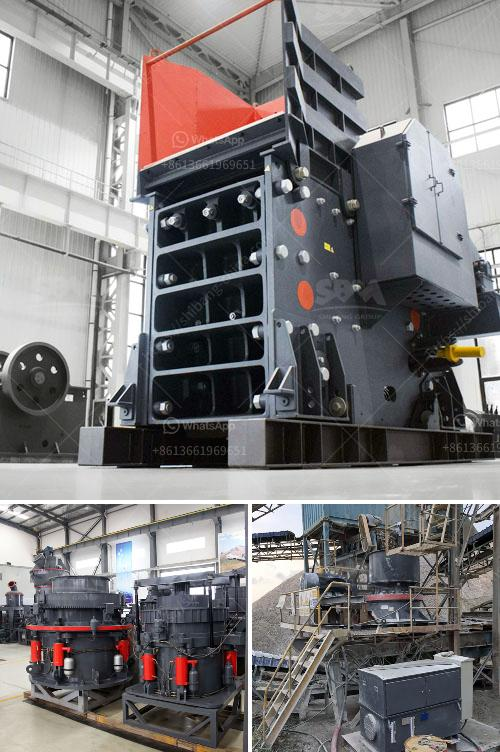

<h3>gold plant for sale philippines</h3>
The Philippines, renowned for its rich natural resources, has long been a hotbed for gold mining. The country's unique geological features present significant opportunities for investment in gold plants. In recent years, there has been a surge in demand for high-quality gold processing plants in the Philippines, creating an ideal environment for investors looking to tap into this lucrative industry. This article delves into the potential benefits and factors to consider when purchasing gold plants in the Philippines.

Gold mining remains a vital component of the Philippine economy. The country's vast mineral reserves hold immense potential for growth and development. Investing in a gold plant allows companies to transform raw materials into high-value commodities, contributing to the nation's overall economic growth. Moreover, gold plants create employment opportunities and drive revenue streams for the government through taxes and royalties.

Acquiring a gold plant in the Philippines requires careful consideration and due diligence. It is crucial to ensure that the equipment meets international standards and adheres to best practices for extraction and processing. Innovative technologies, such as state-of-the-art cyanide-free extraction processes, enable efficient and environmentally friendly gold production. Buyers must prioritize vendors with a strong reputation, track record, and available customer support to ensure the longevity and optimal performance of the plant.

With increasing focus on sustainable mining practices, environmental responsibility is fundamental when choosing a gold plant. Companies and investors should prioritize plants that incorporate responsible environmental practices, minimizing the impact on ecosystems and local communities. Implementing efficient water management systems, waste reduction strategies, and comprehensive reclamation plans are some of the green initiatives that must be considered. By opting for environmentally responsible gold plants, investors can ensure the long-term viability of their operations while contributing to the preservation of the Philippines' natural beauty.

Navigating the regulatory landscape is paramount in the Philippines' gold mining industry. Potential investors should be familiar with the country's laws and regulations surrounding mining permits, community engagements, and environmental compliance. Establishing beneficial relationships with local communities and conducting ethnographic studies can enhance social acceptability, reducing potential conflicts. By maintaining transparency and engaging in open dialogues, investors can build trust and contribute positively to the communities they operate in.

Investing in gold plants in the Philippines represents a golden opportunity for those looking to leverage the country's mineral-rich landscape. Assessing factors such as quality, environmental responsibility, regulations, and social considerations ensures a sustainable and profitable venture.
<h3>Contact us</h3><ul><li><strong>Whatsapp:&nbsp;<a href="https://wa.me/8613661969651">+8613661969651</a></strong></li><li><a href="https://swt.shibang-china.com/?git&amp;zhl&amp;gold plant for sale philippines"><strong>Online Service(chat now)</strong></a></li></ul><h3>Related</h3><ul><li><a href='used clinker grinding mill for sale.md'>used clinker grinding mill for sale</a></li><li><a href='proposal on quarry business.md'>proposal on quarry business</a></li><li><a href='costs of conveyor belts.md'>costs of conveyor belts</a></li><li><a href='orifice of coal mill machine.md'>orifice of coal mill machine</a></li><li><a href='components of the nigerian mining industry.md'>components of the nigerian mining industry</a></li></ul>