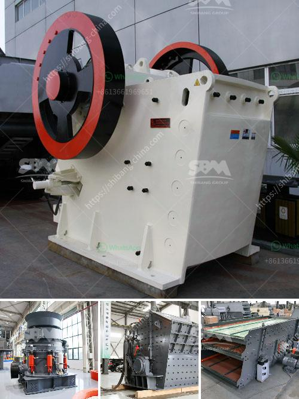

<h3>gold processing equipment price in ghana</h3>
Gold mining is a crucial industry in Ghana, and one that contributes significantly to the country's economy. Ghana is the second largest producer of gold in Africa and has attracted both large-scale multinational mining companies as well as illegal miners, known as galamsey.

As the demand for gold continues to rise worldwide, so does the need for reliable and efficient gold processing equipment. In Ghana, gold processing equipment prices are determined by many factors, such as the brand, capacity, efficiency, and country of origin of the equipment. Some of the leading gold processing equipment suppliers in Ghana include Gold Fields Ghana, AngloGold Ashanti, Golden Star Resources, Kinross Gold Corporation, and Newmont Ghana.

The price of gold processing equipment in Ghana varies according to the type of equipment and the capacity. Some of the smaller equipment has a price tag of around $80,000, while the larger ones can reach up to $350,000. Some of the materials used to manufacture gold processing equipment include stainless steel, aluminum, high-density polyethylene (HDPE), and carbon steel.

One of the main factors that affect the gold processing equipment price in Ghana is the power supply. In many parts of the country, especially in rural areas, electricity is unreliable or non-existent. As a result, miners have to rely on generators, which can increase the overall cost of gold processing. Additionally, fuel prices can have a significant impact on the overall cost of operating mining equipment. When fuel prices are high, miners are forced to pay more for the fuel needed to power their equipment, thus increasing the price of gold processing.

Another factor that affects the gold processing equipment price in Ghana is the availability of spare parts. Mining equipment undergoes wear and tear over time, and it is essential to have easy access to spare parts in case of breakdowns. Spare parts can be expensive, especially if they have to be imported from other countries, thereby increasing the overall cost of maintaining and repairing gold processing equipment.

Additionally, the cost of transporting equipment to remote mining sites can also affect the price of gold processing equipment in Ghana. Remote areas often have poor road infrastructure, making it challenging to transport heavy equipment. In such cases, specialized trucks or even helicopters may be required to transport the equipment, which can be costly.

In conclusion, gold processing equipment prices in Ghana are influenced by several factors, including the brand, capacity, efficiency, power supply, availability of spare parts, and transportation costs. It is essential for miners to consider these factors and conduct thorough research before purchasing equipment. Investing in high-quality and efficient equipment can result in higher production rates and improved profitability for gold mining operations in Ghana.
<h3>Contact us</h3><ul><li><strong>Whatsapp:&nbsp;<a href="https://wa.me/8613661969651">+8613661969651</a></strong></li><li><a href="https://swt.shibang-china.com/?git&amp;zhl&amp;gold processing equipment price in ghana"><strong>Online Service(chat now)</strong></a></li></ul><h3>Related</h3><ul><li><a href='conveyor belts specifications.md'>conveyor belts specifications</a></li><li><a href='ultrafine vertical roller mill.md'>ultrafine vertical roller mill</a></li><li><a href='screw conveyor for sand.md'>screw conveyor for sand</a></li><li><a href='crsusher plant in the philippines.md'>crsusher plant in the philippines</a></li><li><a href='how much price of ball mill.md'>how much price of ball mill</a></li></ul>