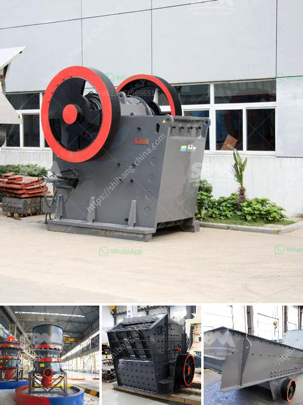

<h3>gold washing plant tons per hour</h3>
Gold mining is a highly lucrative industry, with vast amounts of gold being extracted from the Earth's surface every year. One of the key tools used in this process is the gold washing plant. These plants are designed to efficiently extract gold particles from the surrounding soil, gravel, and rocks, ensuring maximum yield and minimum wastage.

A gold washing plant is a large-scale operation that uses water to wash and separate the gold-bearing soil, gravel, and rocks from the surrounding material. It can process hundreds of tons of material in an hour, making it an essential tool for the modern gold miner.

The gold washing plant operates on a simple principle. Water is sprayed onto the material being processed, which is then agitated and scrubbed to remove the gold particles. The gold particles are heavier than the surrounding material, allowing them to settle at the bottom of the wash plant. From there, they are collected and processed further to extract the pure gold.

The capacity of a gold washing plant is measured in tons per hour. A highly efficient plant can process several hundred tons of material in an hour, resulting in a large yield of gold. Plants with a capacity of 300 to 500 tons per hour are considered quite productive and are a popular choice among gold miners.

The efficiency of a gold washing plant depends on several factors. Firstly, the material being processed must contain a sufficient amount of gold particles. If the gold content is low, the plant may not yield significant results regardless of its capacity. Additionally, the plant's design and operation play a crucial role in its efficiency. A well-designed plant will have optimal water flow, scrubbing action, and settling mechanisms to ensure maximum gold extraction.

Investing in a gold washing plant with a capacity of 300 to 500 tons per hour can be a highly profitable venture. Depending on the current price of gold and the operation's efficiency, such a plant can generate substantial revenue from each hour of operation. However, the initial investment required to set up such a plant can be significant, involving the purchase of heavy machinery, pumps, and other supportive equipment.

Moreover, operating a gold washing plant with such a large capacity also requires a well-trained workforce. The staff must be knowledgeable about the plant's operation, maintenance, and safety protocols to ensure smooth and efficient operation.

In conclusion, a gold washing plant with a capacity of 300 to 500 tons per hour offers great potential for gold miners. These plants efficiently separate gold particles from the surrounding material, maximizing yield and reducing wastage. While the initial investment and operational requirements may be substantial, the profits generated can make it a highly lucrative venture. Careful planning and attention to detail are essential to ensure the plant's efficiency and the smooth running of operations. Overall, a gold washing plant of this scale can significantly contribute to the success of any gold mining endeavor.
<h3>Contact us</h3><ul><li><strong>Whatsapp:&nbsp;<a href="https://wa.me/8613661969651">+8613661969651</a></strong></li><li><a href="https://swt.shibang-china.com/?git&amp;zhl&amp;gold washing plant tons per hour"><strong>Online Service(chat now)</strong></a></li></ul><h3>Related</h3><ul><li><a href='quartz sand particle size quartz powder.md'>quartz sand particle size quartz powder</a></li><li><a href='crusher jaw crusher 10 36.md'>crusher jaw crusher 10 36</a></li><li><a href='cost of cinder powder in bangalore.md'>cost of cinder powder in bangalore</a></li><li><a href='gypsum board processing machinery.md'>gypsum board processing machinery</a></li><li><a href='portable crusher plant.md'>portable crusher plant</a></li></ul>