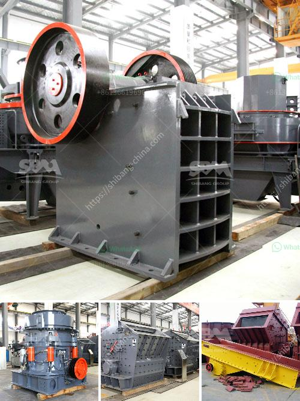

<h3>granite cone crusher</h3>
Granite refers to a common type of intrusive, felsic, igneous rock which is granular and phaneritic in texture. This rock consists mainly of quartz, mica, and feldspar. Granites sometimes occur in circular depressions surrounded by a range of hills, formed by the metamorphic aureole of the surrounding rocks. Due to its hardness and durability, granite has become one of the most popular building materials, used in everything from countertops to monuments.

To efficiently crush this hard rock material, granite cone crushers are very popular and widely used. They are based on the laminated crushing principle and design concept of more crushing and less grinding, which makes the granite cone crusher perform exceptionally well when dealing with hard materials.

The granite cone crusher is composed of a concave housing, hollow eccentric shaft, driving sleeve, and spindle. The spindle rotates under the friction force of the concave, thereby constantly crushing the granite material fed into the crushing chamber. The crushed granite material is discharged out of the crushing chamber through the discharge port at the bottom of the crusher.

1. High Crushing Efficiency: The granite cone crusher crushes materials by laminating crushing, which is an excellent feature for reducing the compressive pressure of stones and prolonging the service life of wear parts.

2. Large Feed Opening: The granite cone crusher is designed with a large feed opening that allows a high volume of material to be processed, making it suitable for fine crushing operations in open-pit mines or quarries.

3. High Production Capacity: With the combination of a large crushing stroke, a high crushing speed, and optimized crushing cavity shape, the granite cone crusher can efficiently process a wide range of materials and generate high production capacity.

4. Easy to Maintain: This type of crusher is equipped with a hydraulic system, which provides overload protection, cavity clearing, and adjustment functions. Moreover, the wear parts are easily replaceable, reducing maintenance downtime and ensuring continuous production.

The granite cone crusher is mainly used for secondary or tertiary crushing of hard rocks. It is used in quarrying, mining, and recycling industries, where materials with a compressive strength of up to 350MPa are crushed to meet the requirements of different size products.

The granite cone crusher plays an irreplaceable role in the crushing of hard, high-quality granite material, and it is the perfect choice for crushing and processing hard rock materials. When the machine works, the rotor rotates at high speed driven by the motor, processing the granite with a compressive strength of up to 350MPa. With its outstanding features, the granite cone crusher is widely used in various industries and has become an essential equipment for many production lines.
<h3>Contact us</h3><ul><li><strong>Whatsapp:&nbsp;<a href="https://wa.me/8613661969651">+8613661969651</a></strong></li><li><a href="https://swt.shibang-china.com/?git&amp;zhl&amp;granite cone crusher"><strong>Online Service(chat now)</strong></a></li></ul><h3>Related</h3><ul><li><a href='to produce tons of li ne powder.md'>to produce tons of li ne powder</a></li><li><a href='grinding machinery for sale in guatemala.md'>grinding machinery for sale in guatemala</a></li><li><a href='coal dry wash project cost.md'>coal dry wash project cost</a></li><li><a href='price list for belt conveyor pdf.md'>price list for belt conveyor pdf</a></li><li><a href='harga stone crusher kapsitas 20 ton.md'>harga stone crusher kapsitas 20 ton</a></li></ul>