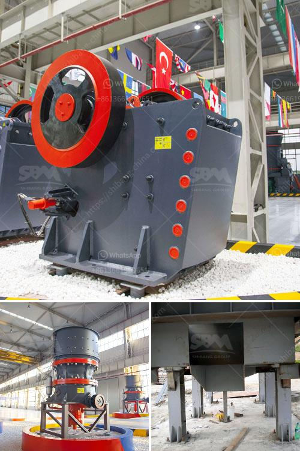

<h3>granite crusher equipment</h3>
Granite is a high-hardness rock that is difficult to crush and has a large wear on the crusher. Therefore, a reasonable crushing scheme is critical for granite production line.

In the early stage of granite processing, it is generally processed into a 10-30mm gravel by a jaw crusher. With the advancement of technology and the increase in the hardness of granite, the cone crusher can be used as a secondary crushing equipment. The combination of the two crushers is more suitable for the crushing of granite.

With the increasing demand for granite in the market, the sales of granite crushers are also increasing. Since the equipment has high hardness, high wear resistance, and other characteristics, it is more suitable for granite crushing. In addition, the granite crusher also has a very wide range of applications. Its output can reach 500-800 tons per hour, which is suitable for large-scale production requirements.

With the development of technology, there are more and more granite crushers in the market, and the models are also increasing, which brings a lot of convenience to customers. The commonly used granite crushers include jaw crusher, impact crusher, cone crusher, and VSI crusher. Since the granite is a hard rock, it requires high wear resistance, which can ensure the long-term operation of the granite crusher.

When it comes to granite crushing equipment, the impact crusher is usually the primary equipment, which can effectively crush granite and provide qualified aggregates for construction. Its cubic final product shape, adjustable discharge size, energy saving, and consumption reduction make impact crusher a popular choice among customers.

The jaw crusher is the most commonly used crushing equipment during the granite crushing process. Jaw crushers are mainly used for coarse crushing and medium crushing of various ores in mine crushing, sandstone production line, and building crushing.

The cone crusher uses the principle of lamination crushing to form a protective layer of material, which not only effectively reduces the wear and tear of the machine, but also extends the service life of the wearing parts. The finished product has a uniform particle size and excellent grain shape, which can fully meet the customer's requirements.

The VSI crusher is the most commonly used equipment in granite processing. The VSI crusher uses the principle of "rock on rock" crushing to effectively apply energy to the rock and realize the crushing process. By adjusting the rotor speed, the VSI crusher can change the size of the product output, which can meet the different breaking needs of customers.

In summary, the granite crusher equipment is an equipment tailored for the crushing of granite, which can effectively reduce the wear of the equipment, and improve the output of the granite processing plant. With the increase of granite applications, the market demand for granite crushers has also increased significantly. Therefore, choosing a suitable granite crusher equipment is critical for the smooth operation of granite production line.
<h3>Contact us</h3><ul><li><strong>Whatsapp:&nbsp;<a href="https://wa.me/8613661969651">+8613661969651</a></strong></li><li><a href="https://swt.shibang-china.com/?git&amp;zhl&amp;granite crusher equipment"><strong>Online Service(chat now)</strong></a></li></ul><h3>Related</h3><ul><li><a href='hammer mill machinery in namibia.md'>hammer mill machinery in namibia</a></li><li><a href='stone crusher for gold mining indonesia.md'>stone crusher for gold mining indonesia</a></li><li><a href='iron ore to iron process made in canada.md'>iron ore to iron process made in canada</a></li><li><a href='jaw crushing machine.md'>jaw crushing machine</a></li><li><a href='trommel screen for sale south africa.md'>trommel screen for sale south africa</a></li></ul>