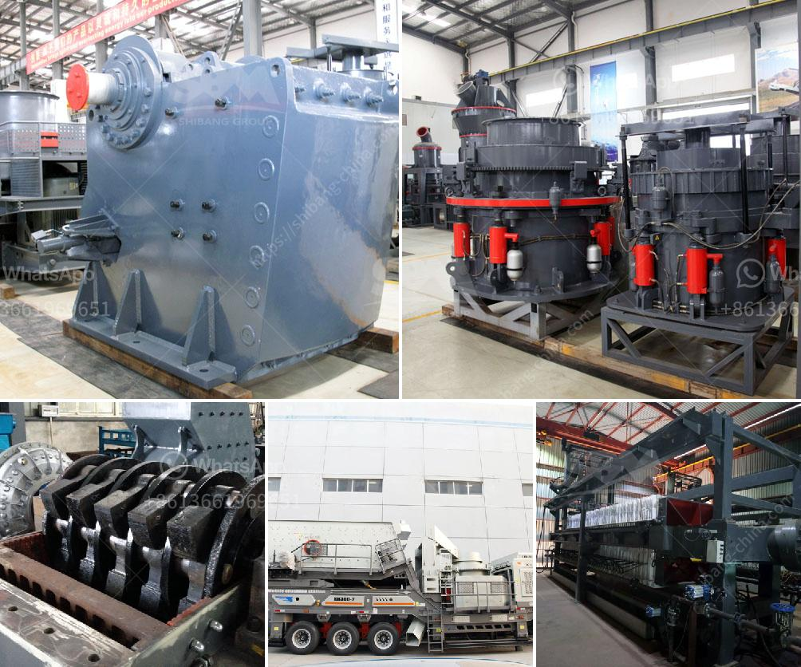

<h3>granite crusher in</h3>
Granite Crusher is a popular character from the popular video game Skylanders Giants. As a fearsome warrior and a rock giant, he is heralded as one of the strongest characters in the game and for good reason.

Granite Crusher was released in a single pack exclusively for the Giants series of Skylanders. This giant, big-wig, special edition figure comes with unique granite-colored features and is one of the largest characters available in the game. His colossal size and strength help him to defeat any enemy that stands in his way.

In terms of abilities, Granite Crusher has a wide range of attacks at his disposal. He can shoot laser beams from his eyes, launch powerful shockwaves, and even summon a swarm of rock spikes to impale his enemies. Furthermore, he has incredible durability, allowing him to withstand heavy blows without giving in easily.

One of the things that make Granite Crusher stand out from other characters is his upgrade path. Players have the option to choose between two different upgrade paths for Granite Crusher – "Path 1" and "Path 2". Each path enhances different abilities and gives players the choice to customize Granite Crusher to suit their play style. This adds a layer of strategy and personalization for players as they can select upgrades that best align with their preferred combat tactics.

Not only is Granite Crusher a formidable warrior in the game, but he also has a captivating backstory. According to his character bio, Granite Crusher was once a regular rock giant who was miraculously brought to life by the Skylanders. With his newfound sentience and powerful abilities, he pledged his loyalty to the Skylanders and set out on a quest to protect Skylands from evil forces.

The design of Granite Crusher is also worth mentioning. The developers have done an excellent job in creating a visually stunning character. The granite-like texture on his body, combined with his menacing expression, makes him an imposing figure on the battlefield. The attention to detail in both the physical figure and in-game appearance shows the dedication and effort put into bringing Granite Crusher to life.

Overall, Granite Crusher is an impressive character in the Skylanders Giants game. With his immense strength, diverse abilities, and unique upgrade paths, he offers players a powerful and customizable gameplay experience. Whether battling enemies or exploring the world of Skylands, Granite Crusher is a force to be reckoned with.

So, if you're a fan of the Skylanders series or simply looking for a strong and visually appealing character to add to your collection, Granite Crusher is definitely one to consider. Just don't underestimate his power, or you might find yourself on the receiving end of his crushing blows!
<h3>Contact us</h3><ul><li><strong>Whatsapp:&nbsp;<a href="https://wa.me/8613661969651">+8613661969651</a></strong></li><li><a href="https://swt.shibang-china.com/?git&amp;zhl&amp;granite crusher in"><strong>Online Service(chat now)</strong></a></li></ul><h3>Related</h3><ul><li><a href='gold hammer mill for sale in south africa.md'>gold hammer mill for sale in south africa</a></li><li><a href='rock crusher for quartz.md'>rock crusher for quartz</a></li><li><a href='mobile crusher in sweden.md'>mobile crusher in sweden</a></li><li><a href='crusher machine manufacturers shanghai.md'>crusher machine manufacturers shanghai</a></li><li><a href='stone crusher for sale in usa.md'>stone crusher for sale in usa</a></li></ul>