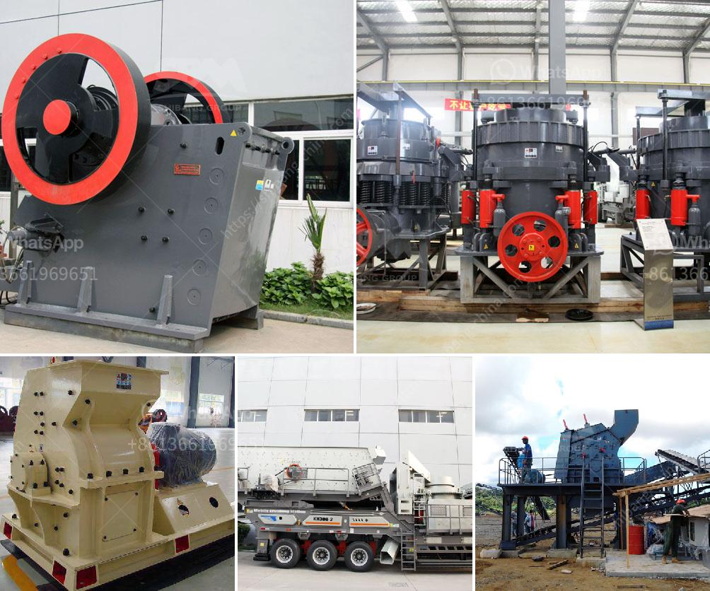

<h3>granite crushers manufacturers</h3>
Granite is a common and widely occurring type of intrusive, felsic, igneous rock. It is usually composed primarily of feldspar, quartz, and biotite or muscovite. Granite is recognized for its durability and strength, making it an ideal material for construction purposes. To obtain granite, it is mined from quarries or extracted from large deposits using advanced machinery. One crucial piece of equipment used in the granite mining and crushing industry is the granite crushers, manufacturers of which are imperative in this highly competitive market.

Granite crushing machines are widely used in small and large scale quarries and mines. These machines are ideal choices for crushing granite stones into required particle sizes. The machine parameters such as speed, eccentric throw, and chamber design are components that need to be optimized for fulfilling the specifications of the granite industry. These crushers are designed and manufactured to exceed the expectations of customers, ensuring efficient and reliable operation.

When choosing a granite crusher manufacturer, several factors must be taken into consideration. The first and foremost factor is the reputation of the manufacturer. Trusted manufacturers with significant experience in the industry are more likely to produce reliable and high-quality machines. They have mastered the techniques involved in crushing granite efficiently and have comprehensive knowledge of the rock's properties.

Another important factor to consider is the manufacturer's commitment to research and development. The granite crushing industry is constantly evolving, with new techniques and technologies emerging. Manufacturers that invest in research and development are better positioned to manufacture crushers that are more efficient, durable, and meet the evolving needs of customers. Advanced technologies such as automation, remote monitoring, and data analytics are incorporated into modern granite crushers, which can improve productivity and reduce downtime significantly.

The availability of after-sales support is another crucial aspect that customers must look for in a manufacturer. Granite crushers require periodic maintenance, repairs, and spare parts replacements. It is essential to choose a manufacturer that offers comprehensive after-sales support, including prompt servicing, readily available spare parts, and technical assistance. This ensures that the crusher operates optimally and experiences minimal downtime, thus maximizing productivity.

One notable manufacturer in the granite crushing industry is XYZ Corporation. With over 20 years of experience, XYZ Corporation has established itself as a reputable and reliable supplier of granite crushers. They have a team of skilled engineers dedicated to the research and development of cutting-edge crushing technologies. XYZ Corporation's crushers are known for their ruggedness, longevity, and exceptional performance.

In conclusion, the choice of a granite crusher manufacturer plays a significant role in the success of any granite mining and crushing operation. Trustworthy manufacturers with a strong reputation, commitment to research and development, and excellent after-sales support are highly desirable. XYZ Corporation is a leading manufacturer in the industry, offering high-quality granite crushers that meet the ever-evolving needs of customers. Investing in a reliable and efficient granite crusher from a reputable manufacturer is a wise decision for any mining or construction company.
<h3>Contact us</h3><ul><li><strong>Whatsapp:&nbsp;<a href="https://wa.me/8613661969651">+8613661969651</a></strong></li><li><a href="https://swt.shibang-china.com/?git&amp;zhl&amp;granite crushers manufacturers"><strong>Online Service(chat now)</strong></a></li></ul><h3>Related</h3><ul><li><a href='dealer of steel balls for ball mill in manila.md'>dealer of steel balls for ball mill in manila</a></li><li><a href='coal crushing and screening plant for sale.md'>coal crushing and screening plant for sale</a></li><li><a href='small scale quarry stone making machine.md'>small scale quarry stone making machine</a></li><li><a href='feasibility study on stone crushing.md'>feasibility study on stone crushing</a></li><li><a href='hammer mill for gold.md'>hammer mill for gold</a></li></ul>