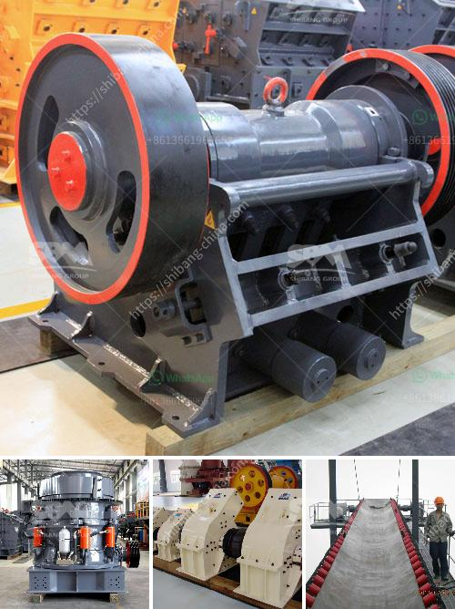

<h3>granite price in kandy srilanka</h3>
The city of Kandy, located in the central highlands of Sri Lanka, has long been renowned for its breathtaking natural beauty and cultural heritage. One aspect that adds to the allure of this city is its exquisite granite, which has been used in various construction projects and interior designs. As a result, the granite price in Kandy, Sri Lanka, has become a topic of interest for those seeking quality and durable materials for their projects.

Granite is a type of igneous rock that is formed from the slow crystallization of magma beneath the Earth's surface. It is widely favored for its durability, strength, and beauty, making it a popular choice for countertops, flooring, and other architectural purposes.

One of the factors that influence the granite price in Kandy is the availability of the raw material. The central highlands of Sri Lanka boast rich reserves of high-quality granite, making it more accessible and affordable compared to other regions. The local granite quarries in Kandy ensure a steady supply, reducing transportation costs that can increase prices in other areas.

The quality of granite also affects its price. Kandy granite is known for its exceptional quality and attractive colors, ranging from whites and greys to pinks, blues, and blacks. The unique patterns and textures found in Kandy granite make it a sought-after choice, especially for those seeking to add a touch of elegance to their homes or commercial spaces.

Additionally, the size and thickness of the granite slabs can impact the price. Larger slabs tend to be pricier due to their higher demand and the need for specialized equipment to cut and transport them. The thickness of the slabs also affects the price, as thicker granite is more robust and can withstand heavy usage, resulting in higher prices.

It is important to consider that granite prices in Kandy, like in any other market, can vary depending on economic factors such as supply and demand. Factors such as installation costs, finishing, and additional services can also influence the final price.

However, it is advisable to approach reputable dealers and suppliers in Kandy to ensure the authenticity and quality of the granite being purchased. Comparing prices and obtaining multiple quotations can help customers make informed decisions while keeping their budget in check.

In conclusion, the granite price in Kandy, Sri Lanka, offers a cost-effective solution for those seeking durable and visually appealing construction materials. With the region's rich granite reserves and the availability of quality suppliers, Kandy remains an attractive destination for purchasing granite for various architectural and interior design needs.
<h3>Contact us</h3><ul><li><strong>Whatsapp:&nbsp;<a href="https://wa.me/8613661969651">+8613661969651</a></strong></li><li><a href="https://swt.shibang-china.com/?git&amp;zhl&amp;granite price in kandy srilanka"><strong>Online Service(chat now)</strong></a></li></ul><h3>Related</h3><ul><li><a href='marble mine processing equipment manufacturers in india.md'>marble mine processing equipment manufacturers in india</a></li><li><a href='2 micron limestone grinding unit in india.md'>2 micron limestone grinding unit in india</a></li><li><a href='quarry plant equipments and costs.md'>quarry plant equipments and costs</a></li><li><a href='kaolin mining processing indonesia.md'>kaolin mining processing indonesia</a></li><li><a href='horizontally ball mill production russia.md'>horizontally ball mill production russia</a></li></ul>