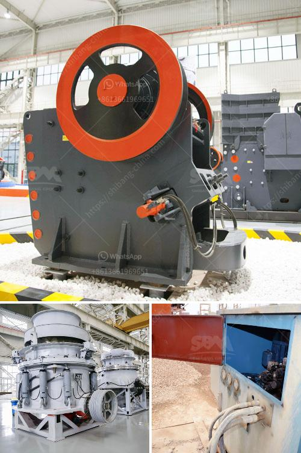

<h3>granite processing machinery</h3>
Granite is a widely used natural stone in construction and interior decoration due to its durability, strength, and beauty. However, turning raw granite into useable products requires specific machinery and expertise. This article will provide an overview of granite processing machinery and its role in the stone industry.

Granite processing machinery refers to the machines and tools that are used to cut, shape, and finish granite slabs and tiles. These machines come in various types and sizes, depending on the specific processes involved in granite processing. Some of the most common granite processing machinery includes bridge saws, edge profiling machines, polishing machines, and CNC machines.

One of the primary machines used in granite processing is the bridge saw. This large, heavy-duty machine uses a diamond-tipped blade to cut granite slabs into desired shapes and sizes. It is equipped with a conveyor system that moves the stone, allowing precise cuts to be made. Bridge saws can be computer-controlled, which ensures accuracy and efficiency in the cutting process.

After the granite slabs are cut into desired shapes, they often require further processing to achieve a polished, refined finish. This is where edge profiling machines and polishing machines come into play. Edge profiling machines use diamond tools to shape and profile the edges of granite slabs, enhancing their aesthetic appeal. Polishing machines, on the other hand, utilize different types of abrasive pads to achieve a smooth, glossy surface on the stone. These machines can be manual or automatic, depending on the production volume and desired level of automation.

Another important tool in granite processing is the CNC (Computer Numerical Control) machine. CNC machines are highly sophisticated and can perform various operations, such as cutting, shaping, and drilling, with precision. They are programmed with specific instructions, eliminating human error and ensuring consistent results. CNC machines have revolutionized the granite industry by streamlining the production process and increasing productivity.

In addition to the machines mentioned above, there are various other tools and equipment used in granite processing, such as water jet cutting machines, router bits, and diamond wire saws. Water jet cutting machines utilize high-pressure water and abrasive materials to cut through granite, while router bits are used for intricate designs and detailing. Diamond wire saws, on the other hand, are suitable for cutting large and thick blocks of granite into slabs.

In conclusion, the granite processing industry heavily relies on machinery to transform raw granite into finished products. Bridge saws, edge profiling machines, polishing machines, and CNC machines are some of the essential tools used in this process. These machines not only increase efficiency and productivity but also ensure high-quality, precise results. With the advancements in technology, the granite processing machinery market continues to evolve, offering even more advanced and automated solutions to meet the growing demands of the stone industry.
<h3>Contact us</h3><ul><li><strong>Whatsapp:&nbsp;<a href="https://wa.me/8613661969651">+8613661969651</a></strong></li><li><a href="https://swt.shibang-china.com/?git&amp;zhl&amp;granite processing machinery"><strong>Online Service(chat now)</strong></a></li></ul><h3>Related</h3><ul><li><a href='stone crushets for sale south aftica.md'>stone crushets for sale south aftica</a></li><li><a href='diamond making machines germany.md'>diamond making machines germany</a></li><li><a href='design for stone crusher plant.md'>design for stone crusher plant</a></li><li><a href='ball mill manufacturers in gujarat.md'>ball mill manufacturers in gujarat</a></li><li><a href='used portable gravel screens for sale.md'>used portable gravel screens for sale</a></li></ul>