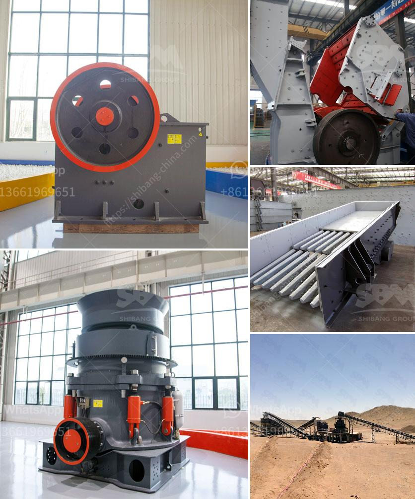

<h3>granite processing machines china</h3>
Granite is a common and popular material used in various construction and interior design projects. It is known for its durability, versatility, and aesthetic appeal. In order to transform raw granite into usable products like countertops, tiles, or decorative items, advanced processing machines are essential. China has emerged as a prominent player in the production and export of granite processing machines. In this article, we will explore the rise of China's granite processing machine industry and its impact on the global market.

China, with its vast reserves of natural stones and skilled labor force, has become a leading player in the global stone processing industry. The country's granite processing machine manufacturers have been able to meet the growing demand for these machines both domestically and internationally. These machines are known for their efficiency, precision, and cost-effectiveness, giving China a competitive edge in the market.

One of the significant factors that have contributed to China's success in the granite processing machine industry is its strong emphasis on research and development. Chinese manufacturers have invested heavily in developing new technologies and innovative designs to enhance the performance of these machines. This continuous focus on improvement has resulted in the production of high-quality machines that meet international standards.

Another advantage China offers is its well-established industrial infrastructure. The country has a robust network of suppliers and manufacturers that provide the necessary components and spare parts required for the production of granite processing machines. This ensures a steady supply chain and reduces manufacturing costs, making Chinese machines more affordable compared to their counterparts from other countries.

China's granite processing machine industry has also been supported by favorable government policies and incentives. The government has encouraged the growth of this industry by offering tax breaks, subsidies, and low-interest loans to manufacturers. This has enabled Chinese companies to invest in advanced machinery and infrastructure, further enhancing their production capacity and quality.

China's dominance in the granite processing machine market is reflected in its export figures. The country exports a significant portion of its production to countries around the world. The reliability and affordability of Chinese machines have made them popular choices for granite processing companies globally. This has contributed to the growth of China's export industry and boosted its position as a leading exporter of these machines.

However, China's rise in the granite processing machine industry has not been without challenges. The increasing competition from other countries, particularly India and Brazil, who also have significant granite reserves, has put pressure on Chinese manufacturers to innovate and ensure their machines deliver superior performance. Additionally, the industry has faced criticism for environmental concerns related to granite quarrying and processing.

In conclusion, China has emerged as a dominant force in the global granite processing machine industry. The country's focus on research and development, robust industrial infrastructure, and favorable government policies have propelled its manufacturers to produce high-quality machines that meet international standards. These machines have gained popularity in both domestic and international markets, making China a major exporter. As the industry continues to evolve, Chinese manufacturers will need to adapt to increasing competition and address environmental concerns to maintain their position as industry leaders.
<h3>Contact us</h3><ul><li><strong>Whatsapp:&nbsp;<a href="https://wa.me/8613661969651">+8613661969651</a></strong></li><li><a href="https://swt.shibang-china.com/?git&amp;zhl&amp;granite processing machines china"><strong>Online Service(chat now)</strong></a></li></ul><h3>Related</h3><ul><li><a href='track mounted jaw crusher.md'>track mounted jaw crusher</a></li><li><a href='used stone crusher in nairobi.md'>used stone crusher in nairobi</a></li><li><a href='crusher new used for sale in uae.md'>crusher new used for sale in uae</a></li><li><a href='dolomite powder machine in sri lanka.md'>dolomite powder machine in sri lanka</a></li><li><a href='small scale stone crusher machine in kenya.md'>small scale stone crusher machine in kenya</a></li></ul>