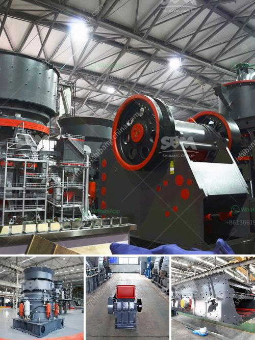

<h3>granite stone crusher india size</h3>
Granite has a substantial position in the Earth's crust, and it also has aquamarine deposits. Granite is being manufactured in countless dimensions, using cutting-edge technology. It is created from igneous rock that forms when magma cools slowly below the Earth's surface. This process allows for a wide range of colors and patterns to form in the stone.

India is a country abundant in granite resources, and it is one of the largest exporters of granite stones. The granite extracted from India is of excellent quality, and it is a popular choice for construction purposes all over the world. One of the key uses of granite in India is as a raw material for the production of countertops, flooring tiles, and other decorative elements.

Granite stone crushers are designed to break the hard material into smaller pieces and withstand strong forces in the process. Granite crusher takes advantages of high efficiency, energy saving, environmental protection and economy aspect. The crushing cavity of granite stone crusher has no dead zone and the crushing ratio is large and the crushing strength is uniform.

Granite stone crushers can be divided into jaw crushers, impact crushers, cone crushers, and sand making machines. The processing capacity of the entire production line can reach up to several hundred tons per hour. The jaw crusher mainly crushes granite. It uses the mutual extrusion and splitting action between the movable jaw plate and the fixed jaw plate to achieve the purpose of crushing.

The impact crusher is mainly used for the medium and fine crushing of granite. It adopts the principle of "stone-to-stone" crushing, which significantly improves the crushing efficiency. The crushed material has a cubic shape and can be used for construction purposes directly, reducing the need for further processing.

The cone crusher is suitable for crushing granite because of its unique crushing principle. The impact crusher uses the impact of the impact plate to crush the material, and the material is repeatedly impacted and crushed by the hammer on the rotor. The cone crusher uses the laminating and crushing principle to form a protective layer, which effectively reduces the wear of parts and extends the service life of the equipment.

Besides the above crushers, there are also sand making machines that can further process granite into different sizes of sand and gravel for construction purposes. The sand making machine uses the principle that the stone hits each other and is crushed to achieve the purpose of crushing.

In conclusion, granite stone crusher India size is necessary for the construction industry. Granite possesses multiple advantageous physical properties which can be utilized for construction purposes. The variety of granite available in India and its abundance in the country make it an ideal choice for construction materials. With the help of advanced machinery and innovative technology, granite stone crushers in India are capable of processing large quantities of granite into smaller sizes, making them suitable for various construction needs.
<h3>Contact us</h3><ul><li><strong>Whatsapp:&nbsp;<a href="https://wa.me/8613661969651">+8613661969651</a></strong></li><li><a href="https://swt.shibang-china.com/?git&amp;zhl&amp;granite stone crusher india size"><strong>Online Service(chat now)</strong></a></li></ul><h3>Related</h3><ul><li><a href='crushing machine for chromium and chromite ore.md'>crushing machine for chromium and chromite ore</a></li><li><a href='stone crusher plant information.md'>stone crusher plant information</a></li><li><a href='cement grinding mill suppliers.md'>cement grinding mill suppliers</a></li><li><a href='fine powder grinders 30 50 microns.md'>fine powder grinders 30 50 microns</a></li><li><a href='used stone crusher in nairobi.md'>used stone crusher in nairobi</a></li></ul>