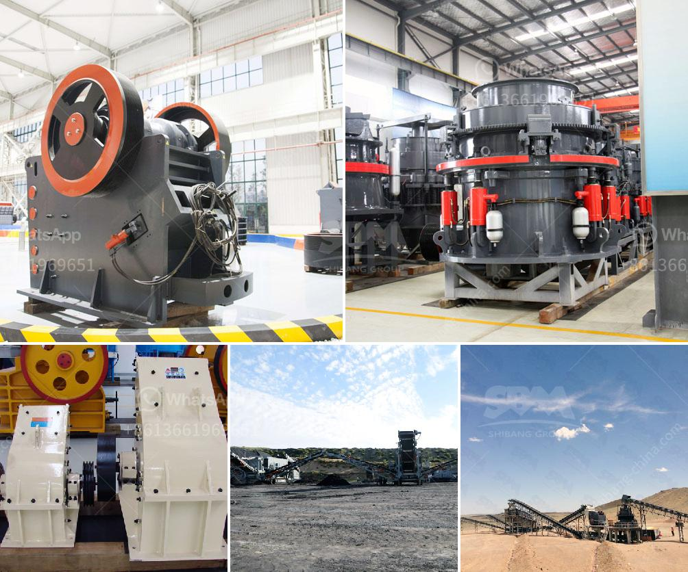

<h3>granite stone crushing machine</h3>
Granite has a wide application in construction and engineering projects due to its hardness and durability. Granite stone crushing is a difficult task as it requires significant investment in machinery and manpower to get the job done efficiently. However, with the development of modern crushing technology, there are mobile and portable stone crushing machines that can reshape and process granite into desired sizes.

Granite stone crushing machines are used in various quarries, including those found in processing industries, landscaping, construction, and chemical industries. These machines help break large pieces of granite into smaller, more manageable sizes and shapes.

One of the most popular granite stone crushing machines on the market is the mobile stone crusher. This type of machine requires a semi-trailer truck to transport it to the job site, where it can then be loaded onto its own wheels for final transportation. The mobile stone crusher is designed to serve as a primary, secondary, or tertiary crushing solution, depending on the size and configuration of the machine.

When operating a mobile stone crusher, it is important to consider factors such as the type and size of the granite to be crushed, the desired output size, and the capacity requirements. These factors will help determine the appropriate machine settings and ensure efficient crushing.

A standard mobile stone crushing machine usually consists of a crusher, vibrating screen, and a conveyor belt. The crusher is responsible for breaking down the granite stones into smaller pieces, which will then be processed further. The vibrating screen separates the crushed stones into different sizes, while the conveyor belt transports them to their respective destinations.

In addition to mobile stone crushers, there are also portable stone crushing machines available. These machines are smaller in size and can be easily moved from one location to another. Portable stone crushers are often used in smaller quarries or construction sites where larger crushing machines may not be feasible.

Regardless of whether it is a mobile or portable stone crushing machine, safety should always be a top priority. It is essential to follow strict safety guidelines, including wearing appropriate personal protective equipment and ensuring proper maintenance of the machine. Regular inspections and maintenance checks will help keep the machine in optimal condition and minimize the risk of accidents.

In conclusion, granite stone crushing machines are vital components in the construction and engineering industries. They help transform large granite pieces into manageable sizes and shapes, making them suitable for a wide range of applications. Whether it is a mobile or portable stone crushing machine, proper usage and regular maintenance are key to ensuring efficient and safe operation.
<h3>Contact us</h3><ul><li><strong>Whatsapp:&nbsp;<a href="https://wa.me/8613661969651">+8613661969651</a></strong></li><li><a href="https://swt.shibang-china.com/?git&amp;zhl&amp;granite stone crushing machine"><strong>Online Service(chat now)</strong></a></li></ul><h3>Related</h3><ul><li><a href='rental of crusher in malaysia.md'>rental of crusher in malaysia</a></li><li><a href='japan directory of mobile crushing plant.md'>japan directory of mobile crushing plant</a></li><li><a href='secondary impact crusher.md'>secondary impact crusher</a></li><li><a href='stone crusher for sale in germany.md'>stone crusher for sale in germany</a></li><li><a href='mobile crusher 100tph for sale.md'>mobile crusher 100tph for sale</a></li></ul>