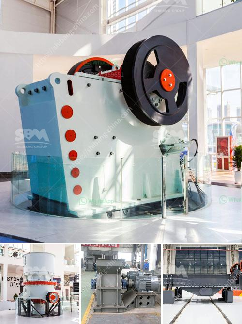

<h3>granite stone crushing plants</h3>
Granite is a common type of igneous rock that is granular in texture. It is found in various colors, including white, brown, gray, pink, and black, and is often used as a building material. One of the main uses of granite is in the construction of buildings, as it is a durable and attractive material. In order to meet the growing demand for granite, stone crushing plants are designed specifically for this purpose.

A granite stone crushing plant consists of a vibrating feeder, a jaw crusher, a cone crusher, a vibrating screen, and belt conveyors. The jaw crusher is used for the primary crushing of granite. It can crush large pieces of granite to a size range of 20-70mm. The cone crusher is used for the secondary crushing of granite, and the final product is as small as 5-10mm. The vibrating screen separates the crushed granite into different sizes.

The granite stone crushing plant is flexible and can be customized according to the specific requirements of customers. The granite crushing production line can be equipped with different sizes of crushers, screeners, and conveyors to meet the different needs of customers.

There are several advantages of granite stone crushing plants. Firstly, the equipment configuration is flexible and can be adjusted according to the customer's requirements. This allows the plant to produce different sizes of crushed granite to meet different construction needs. Secondly, the crushing efficiency is high, which can save a lot of labor and material costs. Thirdly, the granite stone crushing plants are environmentally friendly. The dust and noise pollution during the production process are minimized, which is beneficial to the environment and the health of workers.

In addition, granite stone crushing plants are safe and reliable. The entire production process is controlled by advanced intelligent control systems, which ensures the safety and stability of the operation. The components used in the plant are of high quality and have a long service life.

Granite stone crushing plants are widely used in construction projects, such as highways, railways, bridges, and buildings. They are also used in the production of concrete and asphalt. Granite is a popular choice for kitchen countertops, flooring, and other decorative applications due to its durability and aesthetic appeal.

In conclusion, granite stone crushing plants are essential for the construction industry. They provide a reliable and cost-effective solution for the crushing and screening of granite. With the development of technology, the performance of granite stone crushing plants continues to improve, making them more efficient and environmentally friendly. Whether it is for large-scale construction projects or individual home improvement, granite stone crushing plants are a reliable choice.
<h3>Contact us</h3><ul><li><strong>Whatsapp:&nbsp;<a href="https://wa.me/8613661969651">+8613661969651</a></strong></li><li><a href="https://swt.shibang-china.com/?git&amp;zhl&amp;granite stone crushing plants"><strong>Online Service(chat now)</strong></a></li></ul><h3>Related</h3><ul><li><a href='crusher machine in malaysia.md'>crusher machine in malaysia</a></li><li><a href='kenya mobile crusher.md'>kenya mobile crusher</a></li><li><a href='silica sand crushing plant in pakistan.md'>silica sand crushing plant in pakistan</a></li><li><a href='hammer crusher kapasitas 10 ton per jam dan ukurannya.md'>hammer crusher kapasitas 10 ton per jam dan ukurannya</a></li><li><a href='nigeira mobile crushing plant.md'>nigeira mobile crushing plant</a></li></ul>