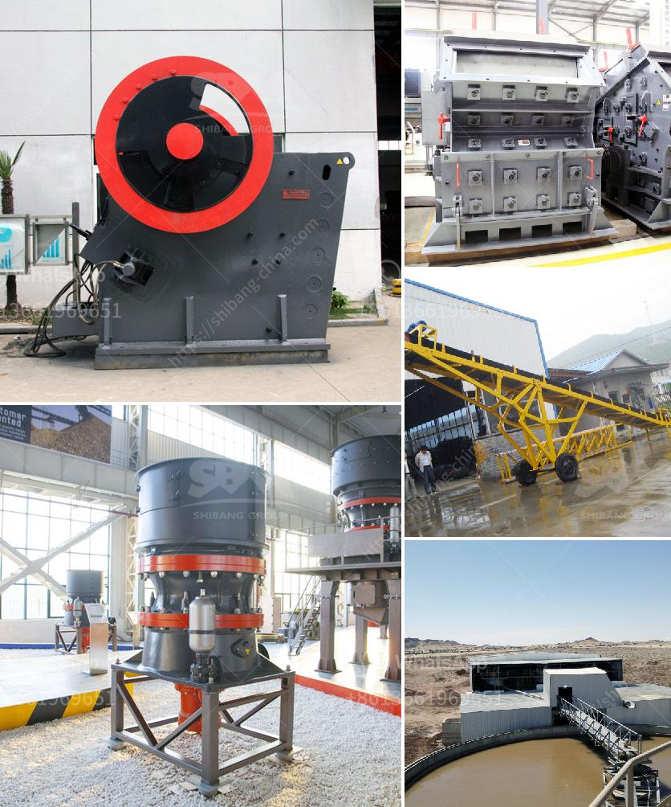

<h3>granular barite production process flow</h3>
Granular barite, also known as barium sulfate, is a mineral that is typically used in various industries such as oil and gas drilling, paint and coatings, and pharmaceuticals. The production of granular barite involves several important steps to ensure the quality and consistency of the final product. In this article, we will explore the process flow of granular barite production.

The first step in the production process is mining. Barite is typically found in veins or beds, and it is extracted from the earth through underground or surface mining methods. Once the barite ore is extracted, it is transported to a processing facility where it is crushed and pulverized into a fine powder.

The next step in the process is beneficiation. This involves removing impurities and increasing the barite content through various techniques such as washing, jigging, and magnetic separation. Beneficiation is important to ensure that the final product meets the desired specifications and quality standards.

After beneficiation, the barite undergoes further processing to achieve the desired particle size. This is typically done through grinding and milling processes. The barite powder is fed into a mill, where it is ground down to a specified particle size. This step is crucial to ensure that the granular barite meets the requirements of its intended application.

Once the barite powder has been ground to the desired particle size, it is then classified and separated into different grades based on its granule size distribution. This is typically done using a combination of sieving and air classification techniques. The classified granular barite is then collected and stored in silos or containers ready for packaging and distribution.

In the final step of the granular barite production process, the product is packaged and shipped to customers. The packaging is usually done in bags or bulk containers, depending on the customer's requirements. It is important to ensure that the packaging is robust and secure to prevent any contamination or damage during transportation.

Throughout the entire production process, quality control measures are implemented to ensure that the granular barite meets the required specifications. This involves regular sampling and testing of the product to check for impurities, particle size, and other parameters. Any deviations from the desired quality standards are identified and corrective actions are taken to rectify the issue.

Overall, the production of granular barite involves a series of well-defined steps to ensure the quality and consistency of the final product. From mining to beneficiation, grinding, classification, and packaging, each stage plays a crucial role in producing high-quality granular barite suitable for various industrial applications.
<h3>Contact us</h3><ul><li><strong>Whatsapp:&nbsp;<a href="https://wa.me/8613661969651">+8613661969651</a></strong></li><li><a href="https://swt.shibang-china.com/?git&amp;zhl&amp;granular barite production process flow"><strong>Online Service(chat now)</strong></a></li></ul><h3>Related</h3><ul><li><a href='limestone grinding process.md'>limestone grinding process</a></li><li><a href='granite crushers manufacturers.md'>granite crushers manufacturers</a></li><li><a href='costs of a cone crusher.md'>costs of a cone crusher</a></li><li><a href='mobile cone crusher hire malaysia.md'>mobile cone crusher hire malaysia</a></li><li><a href='stone crusher user manual.md'>stone crusher user manual</a></li></ul>