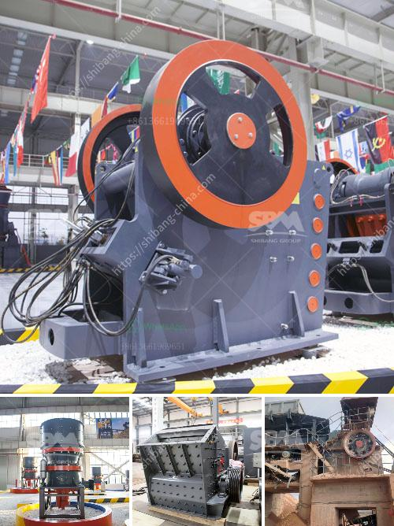

<h3>graphite beneficiation plant for sale</h3>
Graphite is a mineral resource with a wide range of applications and uses. It is one of the most versatile materials in the world and has gained increasing importance in various industries. This has led to the establishment of graphite beneficiation plants to improve the purity and quality of this valuable mineral.

Graphite beneficiation is the process of obtaining the graphite material from its ores. This process is done to improve the graphite quality, remove any impurities, and increase the carbon content. The end result of the beneficiation process is a graphite concentrate with a carbon content above 90%, which is ideal for various applications.

The graphite beneficiation plant for sale is designed for both traditional and modern applications. The plant is equipped with state-of-the-art technology and has a capacity of 200-300 tons per day. It can produce high-quality graphite concentrate for various applications such as batteries, lubricants, and pencils.

The beneficiation process consists of several stages, including crushing, grinding, flotation, and dewatering. In the crushing stage, the ore is crushed into small particles to facilitate the subsequent grinding process. The grinding is done to liberate the graphite particles and prepare them for the flotation process.

During flotation, the graphite particles are selectively separated from the impurities using chemical reagents. This step is crucial to achieve a high carbon content in the concentrate. After flotation, the concentrate goes through a dewatering process to remove excess water and obtain a dry graphite concentrate.

The sale of graphite from the beneficiation plant is an attractive opportunity for both investors and end-users. By purchasing the graphite concentrate, the end-users can be assured of the graphite's quality and purity. They can also avoid the costs and complexities of establishing their own beneficiation plants.

Investors, on the other hand, can benefit from the growing demand for graphite in various industries. With the establishment of the graphite beneficiation plant, they have the opportunity to supply a high-quality product to the market and capitalize on the increasing graphite prices.

The graphite beneficiation plant for sale is expected to achieve a high return on investment due to its low operating costs, competitive pricing, and increasing demand for graphite. The plant's strategic location also ensures easy access to transportation and raw materials, further enhancing its profitability.

In conclusion, the graphite beneficiation plant for sale offers an attractive opportunity to both investors and end-users. The plant's modern technology and high-quality graphite concentrate ensure a sustainable supply of this valuable mineral to various industries. With the increasing demand for graphite and favorable market conditions, investing in the graphite beneficiation plant promises a lucrative venture.
<h3>Contact us</h3><ul><li><strong>Whatsapp:&nbsp;<a href="https://wa.me/8613661969651">+8613661969651</a></strong></li><li><a href="https://swt.shibang-china.com/?git&amp;zhl&amp;graphite beneficiation plant for sale"><strong>Online Service(chat now)</strong></a></li></ul><h3>Related</h3><ul><li><a href='process of granite mining crusher machines used.md'>process of granite mining crusher machines used</a></li><li><a href='mini crusher for gravel sale in philippines.md'>mini crusher for gravel sale in philippines</a></li><li><a href='ultrafiner grinding mill.md'>ultrafiner grinding mill</a></li><li><a href='cement vertical roller mill price.md'>cement vertical roller mill price</a></li><li><a href='rolls crusher for sale.md'>rolls crusher for sale</a></li></ul>