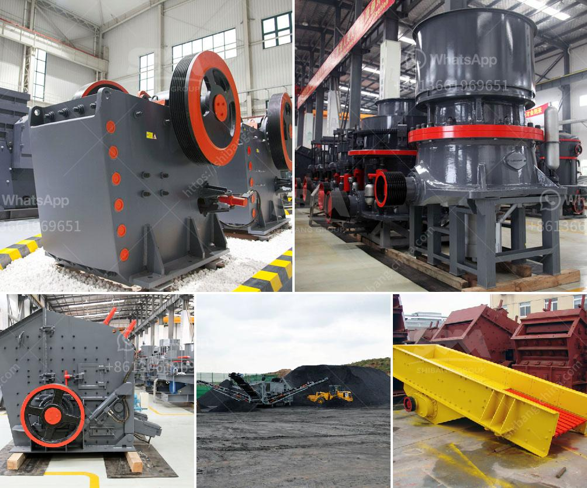

<h3>graphite processing plant</h3>
Graphite is an essential raw material utilized in various industries such as electronics, aerospace, automotive, and renewable energy. Its unique properties, including thermal and electrical conductivity, lubricity, and chemical inertness, make it indispensable in the manufacturing of batteries, electrodes, lubricants, and other high-performance products.

To satisfy the increasing demand for graphite, the establishment of an efficient graphite processing plant is crucial. Such a facility ensures the transformation of natural graphite into high-quality graphite products suitable for diverse industrial applications. Let us delve into the key aspects of a graphite processing plant and explore its significance.

The first step in the graphite processing plant involves the extraction of natural graphite ore. This mineral is typically found in various forms, including amorphous graphite, flake graphite, and vein graphite. Each form possesses distinct characteristics, necessitating specific extraction techniques. Once the graphite is extracted and purified, it undergoes various processes within the processing plant to convert it into valuable products.

One of the primary processes in the graphite processing plant is crushing and grinding. The graphite ore is crushed into small particles, ensuring the liberation of graphite flakes from the host rock. Grinding further reduces the size of the particles, creating a fine powder that can be easily processed.

Once the graphite is in powder form, it goes through a series of beneficiation processes. These processes aim to further purify the graphite and remove impurities, ultimately enhancing its quality. Techniques such as flotation, magnetic separation, and acid leaching are employed to concentrate the graphite, improving its carbon content.

The concentrated graphite is then subjected to thermal treatment in special furnaces. This process is known as graphite purification or graphitization, which involves heating the graphite at extremely high temperatures. The thermal treatment transforms the graphite into a more ordered crystal structure, improving its electrical conductivity and thermal stability.

After graphitization, the purified graphite is ready for shaping and molding into various products. Depending on the intended applications, the graphite can be further processed into different forms, such as graphite rods, sheets, powders, or lubricants. These final products undergo rigorous quality control measures to ensure they meet the industry standards and customer requirements.

The establishment of a graphite processing plant offers numerous benefits. Firstly, it reduces reliance on imported graphite, enabling countries to become self-sufficient in meeting their demand. Additionally, it creates employment opportunities in the local community, contributing to economic growth. Moreover, a well-equipped processing plant ensures consistent and reliable supply of high-quality graphite products, fostering the growth of downstream industries.

However, the establishment of a graphite processing plant requires careful consideration of environmental concerns. Mining and processing graphite can have an adverse impact on the environment if not managed properly. Implementing efficient waste management systems, minimizing water and energy consumption, and adopting green practices can help mitigate these environmental impacts.

In conclusion, a graphite processing plant plays a vital role in converting natural graphite into high-quality products suitable for various industries. Its processes, including crushing, grinding, beneficiation, graphitization, and shaping, transform the graphite into valuable forms. With strict adherence to environmental standards, the plant contributes to self-sufficiency, economic growth, and sustainable development. By harnessing the potential of graphite, we can thrive in creating advanced technologies and products that shape the future.
<h3>Contact us</h3><ul><li><strong>Whatsapp:&nbsp;<a href="https://wa.me/8613661969651">+8613661969651</a></strong></li><li><a href="https://swt.shibang-china.com/?git&amp;zhl&amp;graphite processing plant"><strong>Online Service(chat now)</strong></a></li></ul><h3>Related</h3><ul><li><a href='typical flow sheet for granite quarry.md'>typical flow sheet for granite quarry</a></li><li><a href='sand stone quarry mining.md'>sand stone quarry mining</a></li><li><a href='mobile stone crushing.md'>mobile stone crushing</a></li><li><a href='stone crusher price 20x20 stone.md'>stone crusher price 20x20 stone</a></li><li><a href='barite powder mill in india.md'>barite powder mill in india</a></li></ul>