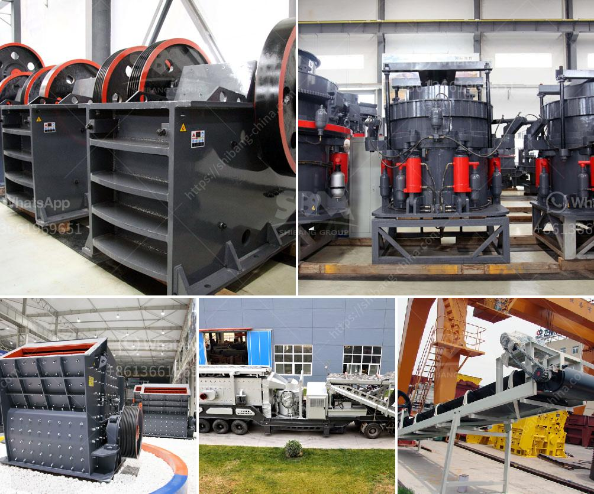

<h3>gravel crusher price</h3>
Gravel Crusher Price plays a crucial role in your construction projects. Knowing that you need an efficient machine for your construction tasks is indispensable. However, knowing the factors that influence Gravel Crusher Price is equally important. With a myriad of options available, it is crucial to consider several aspects before choosing the right equipment.

First and foremost, the size and capacity of the gravel crusher are important factors to consider. The size of the gravel pieces you need to crush will determine the machine's size and capacity. It is essential to choose a crusher that can handle the required output efficiently and effectively. Machines with higher capacities tend to be more expensive due to the increased materials and components necessary for their construction.

Another critical factor influencing Gravel Crusher Price is the type of machine you choose. There are several types of crushers available, such as impact crushers, jaw crushers, cone crushers, and more. Each type has its advantages and disadvantages, depending on the specific construction needs. For instance, impact crushers are suitable for simpler construction projects, while cone crushers are ideal for more robust and demanding applications. The type of crusher you select will affect the price, so it is crucial to consider your project requirements carefully.

Additionally, the brand and quality of the gravel crusher can significantly impact the price. Reputable brands often come at a higher price due to their commitment to quality, durability, and reliability. Investing in a well-known brand ensures you are getting a machine that will perform optimally and withstand the test of time. While opting for a cheaper, lesser-known brand might save some money initially, it could lead to higher long-term costs due to maintenance, repairs, and shorter machine lifespan.

Furthermore, accessories and added features can influence the Gravel Crusher Price. Some crushers come equipped with additional features that enhance their performance and efficiency. These features may include dust suppression systems, remote control capabilities, and adjustable settings. While these added features might increase the initial cost, they can contribute to the quality and ease of operation, making them worth considering.

Lastly, it is essential to consider the overall cost-effectiveness of the gravel crusher. Evaluating the machine's productivity, efficiency, and maintenance requirements can help you gauge its long-term value. A crusher that is energy-efficient and requires minimal maintenance will prove to be more cost-effective in the long run. Additionally, opting for a machine with easy-to-find spare parts and service providers can save you time and money on repairs and replacements.

In conclusion, Gravel Crusher Price is influenced by various factors such as size, capacity, type, brand, and added features. Considering these aspects can help you make an informed decision and invest in a crusher that meets your specific construction needs. By choosing a reliable machine from a reputable brand, you can ensure its longevity and optimal performance. Ultimately, prioritizing cost-effectiveness and long-term value will ensure that your investment in a gravel crusher is worthwhile.
<h3>Contact us</h3><ul><li><strong>Whatsapp:&nbsp;<a href="https://wa.me/8613661969651">+8613661969651</a></strong></li><li><a href="https://swt.shibang-china.com/?git&amp;zhl&amp;gravel crusher price"><strong>Online Service(chat now)</strong></a></li></ul><h3>Related</h3><ul><li><a href='stone crusher machine in pakistan.md'>stone crusher machine in pakistan</a></li><li><a href='used mobile jaw crushers for sale in uae.md'>used mobile jaw crushers for sale in uae</a></li><li><a href='calcite crushing equipment.md'>calcite crushing equipment</a></li><li><a href='crushing and screening plant supplier china.md'>crushing and screening plant supplier china</a></li><li><a href='used stone crusher in nairobi.md'>used stone crusher in nairobi</a></li></ul>