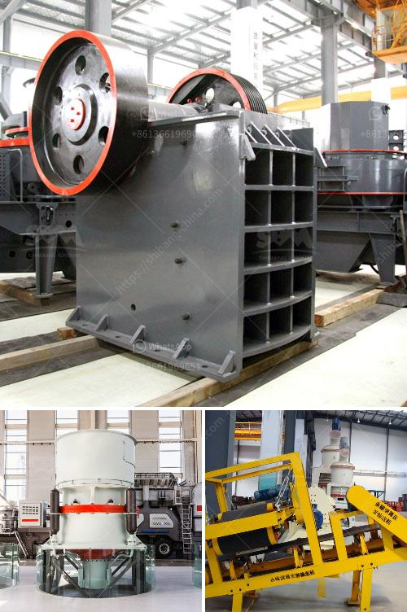

<h3>gravel crushers machine</h3>
Gravel is a versatile aggregate material that is used for various construction purposes. Gravel crushers are machines that are utilized to crush and screen gravel in order to separate it into different sizes and remove impurities. They are essential equipment in industries such as mining, construction, and landscaping.

One of the key advantages of gravel crushers is their ability to crush the material into smaller sizes, enabling easier transportation and usage in different applications. Whether it is used as a base material for roads, a drainage filler, or as a decorative element in the landscape, crushed gravel offers numerous benefits. The compact and uniform nature of crushed gravel ensures better stability and durability, making it suitable for various construction projects.

In addition to crushing, gravel crushers also help in the efficient screening of the material. The machine separates the gravel into different sizes by using screens of varying mesh sizes. This ensures that the final product is of the right size and meets the specific requirements of the project. Furthermore, the efficient screening process removes any unwanted debris or impurities from the gravel, ensuring a high-quality end product.

Gravel crushers are available in various types and sizes, ranging from portable units for simple crushing tasks to large crushers for handling complex materials. These machines are designed to crush different types of gravel efficiently, whether it is limestone, granite, or even recycled asphalt.

To operate a gravel crusher, one requires proper training and expertise. It is crucial to follow safety guidelines and adhere to the manufacturer's instructions to prevent accidents and ensure the machine's longevity. Regular maintenance and inspections are also essential to keep the crusher in optimal condition.

In conclusion, gravel crushers are valuable machines that play a significant role in the construction industry. They help in crushing and screening gravel into different sizes, making it suitable for various applications. Their efficient operation and ability to produce high-quality crushed gravel contribute to the success of construction projects. However, it is important to operate and maintain these machines with care to ensure their safe and efficient functioning.
<h3>Contact us</h3><ul><li><strong>Whatsapp:&nbsp;<a href="https://wa.me/8613661969651">+8613661969651</a></strong></li><li><a href="https://swt.shibang-china.com/?git&amp;zhl&amp;gravel crushers machine"><strong>Online Service(chat now)</strong></a></li></ul><h3>Related</h3><ul><li><a href='high capacity high quality cone crusher to rent.md'>high capacity high quality cone crusher to rent</a></li><li><a href='salt machinery manufacturers india price.md'>salt machinery manufacturers india price</a></li><li><a href='crushing plant process flow.md'>crushing plant process flow</a></li><li><a href='chart of accounts for cement factory.md'>chart of accounts for cement factory</a></li><li><a href='south africa coal mining cost per ton.md'>south africa coal mining cost per ton</a></li></ul>