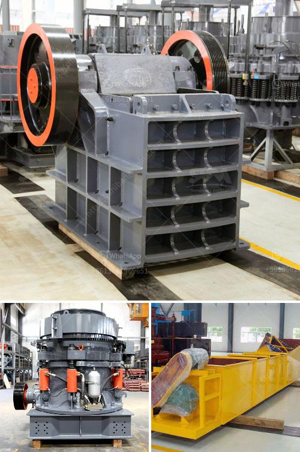

<h3>grinder machine parts and function</h3>
A grinder machine, often referred to as a grinding machine, is a powerful tool used for removing excess material from an object. In order to achieve a high level of precision, it employs a rotating abrasive wheel or belt that grinds away unwanted material from the workpiece. To understand the functionality of a grinder machine, it is essential to comprehend its different parts and functions.

One of the main components of a grinder machine is the abrasive wheel or belt. This wheel or belt is made up of abrasive particles, such as aluminum oxide or silicon carbide, which are bonded together to form a strong and durable material. The abrasive wheel is responsible for removing material from the surface of the workpiece, while the abrasive belt is used for grinding larger and more irregularly shaped objects.

The wheel guard is another important part of a grinder machine. This protective covering is usually made of metal or plastic and acts as a shield between the abrasive wheel and the operator. It prevents any debris or sparks produced during the grinding process from causing harm to the operator.

A grinder machine is powered by an electric motor, which provides the necessary rotation to drive the abrasive wheel or belt. The motor is connected to the grinding wheel through a system of gears and belts, ensuring smooth and efficient power transmission.

In addition to the motor, a grinder machine includes a worktable or workbench on which the workpiece is placed. This worktable can be adjusted in different directions, allowing for precise positioning of the workpiece. Some grinder machines also have a chuck or vise mechanism that securely holds the workpiece in place during the grinding process.

To control the movement of the abrasive wheel or belt, a grinder machine features a control panel. This panel contains various switches and knobs that allow the operator to adjust different parameters, such as the speed of the wheel or belt and the depth of cut. These controls enable the operator to achieve the desired level of precision and surface finish.

To ensure safe operation and prevent accidents, a grinder machine is equipped with several safety features. One common safety mechanism is the emergency stop button, which immediately halts the operation of the machine in case of an emergency. Additionally, grinder machines often have a spark shield or eye protection shield to shield the operator's eyes from any flying debris or sparks.

In conclusion, a grinder machine consists of several key parts that work together to facilitate effective material removal from a workpiece. These include the abrasive wheel or belt, wheel guard, electric motor, worktable, control panel, and various safety features. By understanding the different parts and their functions, operators can harness the full potential of a grinder machine to achieve precise and efficient grinding operations.
<h3>Contact us</h3><ul><li><strong>Whatsapp:&nbsp;<a href="https://wa.me/8613661969651">+8613661969651</a></strong></li><li><a href="https://swt.shibang-china.com/?git&amp;zhl&amp;grinder machine parts and function"><strong>Online Service(chat now)</strong></a></li></ul><h3>Related</h3><ul><li><a href='cost of cement clinker grinding unit.md'>cost of cement clinker grinding unit</a></li><li><a href='standard ratio for cement sand building blocks.md'>standard ratio for cement sand building blocks</a></li><li><a href='conveyor belt capacity.md'>conveyor belt capacity</a></li><li><a href='laboratory jaw crusher.md'>laboratory jaw crusher</a></li><li><a href='concrete crusher prices.md'>concrete crusher prices</a></li></ul>