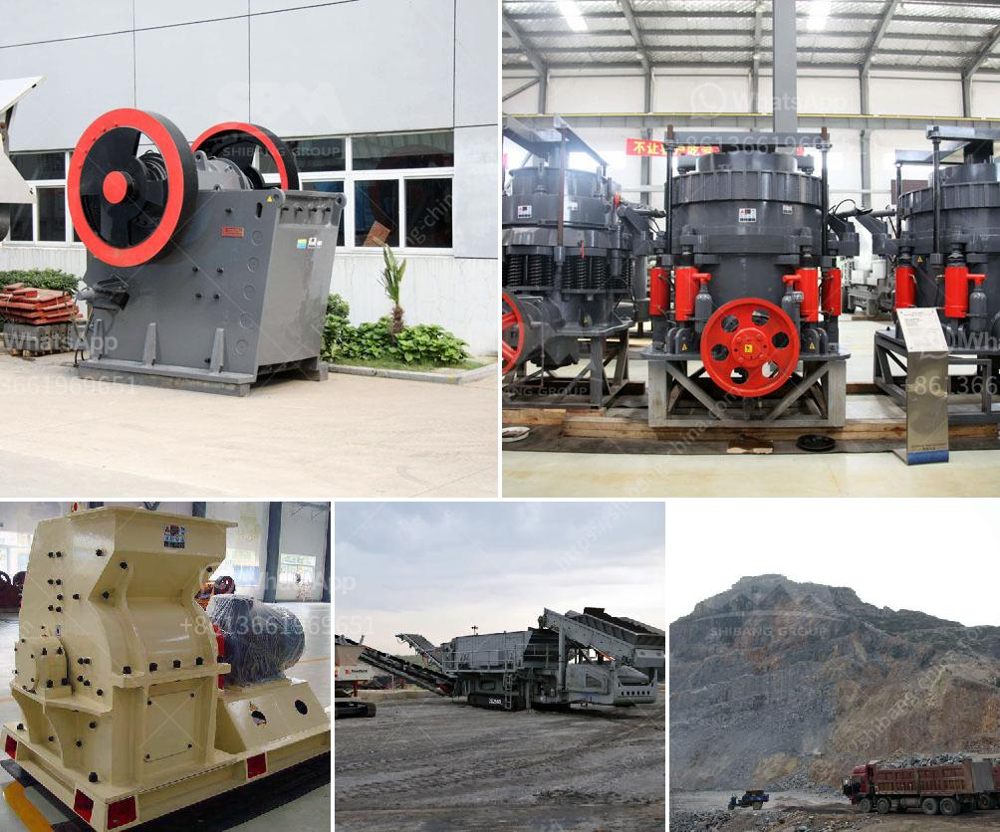

<h3>grinder mill in malaysia</h3>
Malaysia is a diverse country that boasts a rich culinary tradition. From traditional dishes like Nasi Lemak and Satay to modern fusion cuisine, Malaysians love their food. Many of these recipes require the use of finely ground spices and ingredients, making a grinder mill an essential tool in every Malaysian kitchen.

A grinder mill, also known as a spice mill or pepper mill, is a device used to grind spices and other ingredients to a fine powder. It consists of a small container with teeth or blades that grind the ingredients when rotated. This simple yet effective tool allows Malaysians to extract the maximum flavor from their spices and elevate the taste of their dishes.

One of the most popular uses of a grinder mill in Malaysia is in the preparation of traditional spice pastes, also known as rempah. These pastes are the foundation of many Malaysian dishes and are made by grinding various spices and ingredients together. The grinder mill helps break down the spices and blend them into a smooth paste, resulting in a more flavorful and aromatic base for curries, stir-fries, and marinades.

In addition to rempah, a grinder mill is also essential for grinding individual spices like cinnamon, star anise, and cloves. Malaysians often prefer to grind these spices themselves as it ensures freshness and allows them to control the coarseness of the grind. Freshly ground spices not only enhance the taste of dishes but also add a vibrant aroma that can instantly transport anyone to the heart of Malaysia.

The grinder mill is not limited to spices alone. It is also an excellent tool for grinding coffee beans, nuts, and even dried herbs. Malaysians take their coffee seriously, and many households prefer to grind their coffee beans for a fresher and more robust flavor. Similarly, the grinder mill is also used to crush nuts, such as peanuts for sauces and desserts, or to grind dried herbs for homemade spice blends.

With the advancement of technology, there are various types of grinder mills available in the market, from manual to electric. The manual grinder mills require physical effort to rotate the blades, while electric ones offer convenience with a motorized grinding mechanism. The choice of grinder mill depends on personal preference and the volume of grinding required.

In conclusion, a grinder mill is an indispensable tool in Malaysian kitchens. It allows Malaysians to create flavorful spice pastes, enhance the taste of dishes, and add an aromatic touch to their culinary creations. Whether it is for grinding traditional spices or preparing coffee, nuts, or herbs, the grinder mill is a versatile tool that brings out the best flavors in Malaysian cuisine.
<h3>Contact us</h3><ul><li><strong>Whatsapp:&nbsp;<a href="https://wa.me/8613661969651">+8613661969651</a></strong></li><li><a href="https://swt.shibang-china.com/?git&amp;zhl&amp;grinder mill in malaysia"><strong>Online Service(chat now)</strong></a></li></ul><h3>Related</h3><ul><li><a href='portable stone crushers.md'>portable stone crushers</a></li><li><a href='ball grinding machine manufacturer in india.md'>ball grinding machine manufacturer in india</a></li><li><a href='vibratory feeders in south africa.md'>vibratory feeders in south africa</a></li><li><a href='standard ratio for cement sand building blocks.md'>standard ratio for cement sand building blocks</a></li><li><a href='the cost of stone crusher in pakistan.md'>the cost of stone crusher in pakistan</a></li></ul>