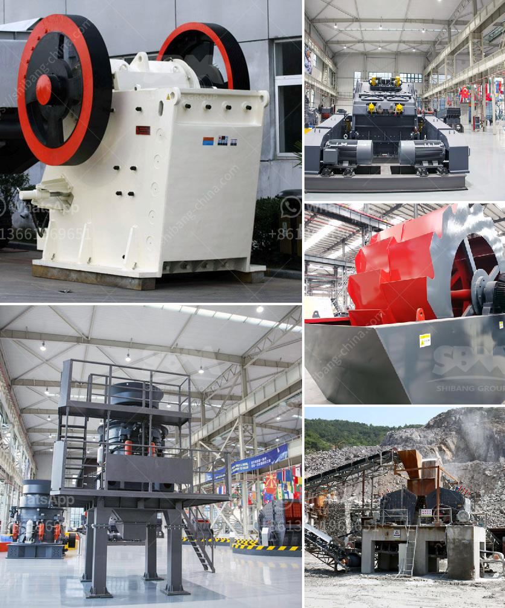

<h3>grinding equipment cost estimate</h3>
When it comes to industrial operations that require precision and efficiency, grinding equipment plays a crucial role. Whether it's for metal fabrication, woodworking, or even food processing, having the right grinding equipment is essential. However, one of the primary concerns that businesses face is estimating the cost of such equipment.

Grinding equipment can range from simple hand tools to highly advanced machinery, each with its own set of features and price points. Factors that affect the cost of grinding equipment include the type of material being processed, the desired level of precision, production volume, and the machinery's overall quality.

For smaller operations or occasional use, handheld grinders might suffice. These are generally more affordable, with price ranges starting from as low as $20. However, when dealing with larger projects or more intricate work, more sophisticated machinery is required. Bench grinders, for instance, come with various attachments and can cost anywhere from $50 to $200.

For heavy-duty applications or continuous industrial use, floor-standing grinders become necessary. These units typically offer more power, durability, and precision than their smaller counterparts. The prices for floor-standing grinders can range from $500 to well over $10,000, depending on the specific requirements and desired features.

Additional costs to consider when estimating grinding equipment expenses include accessories, such as grinding wheels or diamond cutting discs, maintenance and servicing, and any necessary safety equipment.

While it's natural to be wary of high upfront costs, it's essential to remember that investing in quality grinding equipment can lead to long-term cost savings. Durable machinery with efficient operation and minimal downtime can increase productivity and reduce the need for frequent replacements or repairs. It is crucial to strike a balance between budget considerations and the quality and reliability of the equipment.

In conclusion, estimating the cost of grinding equipment involves evaluating the nature of the project, production needs, and the level of sophistication required. Taking into account initial purchase costs, ongoing maintenance, and potential productivity gains is crucial in making an informed investment decision. By carefully assessing these factors, businesses can select the most cost-effective grinding equipment that suits their operational requirements.
<h3>Contact us</h3><ul><li><strong>Whatsapp:&nbsp;<a href="https://wa.me/8613661969651">+8613661969651</a></strong></li><li><a href="https://swt.shibang-china.com/?git&amp;zhl&amp;grinding equipment cost estimate"><strong>Online Service(chat now)</strong></a></li></ul><h3>Related</h3><ul><li><a href='stone aggregate screen in south africa.md'>stone aggregate screen in south africa</a></li><li><a href='price of grinder machine in india.md'>price of grinder machine in india</a></li><li><a href='stone crusher plant information.md'>stone crusher plant information</a></li><li><a href='mining of granite companies.md'>mining of granite companies</a></li><li><a href='stationary jaw crusher.md'>stationary jaw crusher</a></li></ul>