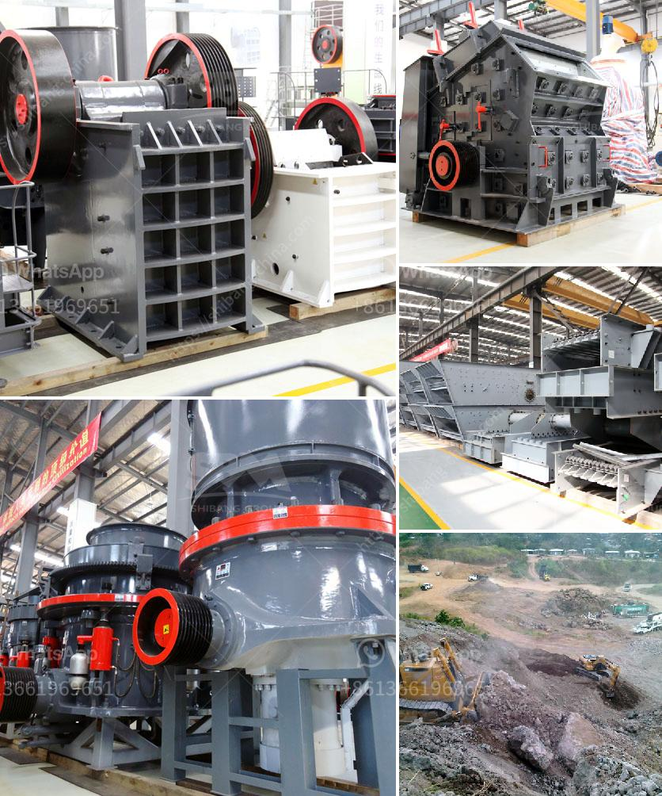

<h3>grinding feldspar for glazes</h3>
Feldspar, a crucial component in ceramic glazes, plays a significant role in enhancing the visual appeal and surface quality of ceramic products. By grinding feldspar, ceramic artists and manufacturers can create glazes with captivating colors and improved functionality. This article delves into the process of grinding feldspar for glazes, highlighting its importance, benefits, and techniques to achieve excellent results.

Feldspar is a naturally occurring mineral found in various types of rock formations. Its unique chemical composition, rich in alumina, silica, and other minerals, makes it an ideal material for producing ceramic glazes. Through grinding, feldspar is reduced to fine particles, which ensures a homogenous and smooth consistency in glaze formulations. Grinding feldspar enhances its reactivity, allowing for better mixing and application during the glazing process.

1. Improved Surface Appearance: Ground feldspar particles facilitate the formation of an even glaze layer, resulting in a glossy and visually appealing surface. The fine particles ensure that the glaze is evenly distributed, reducing the risk of unsightly imperfections or pinholes in the final product.

2. Enhanced Color Development: Grinding feldspar releases color-imparting minerals, such as iron and titanium, promoting vibrant and rich glaze hues. The fine particles increase the dispersion of these minerals, leading to more intense and uniform colors when applied to ceramic surfaces.

3. Consistent Glaze Application: Uniformly ground feldspar enables easy mixing and application of glazes. The absence of coarse particles in the glaze formulation ensures smooth brush strokes or even spraying, resulting in a consistent and professional finish.

1. Ball Milling: One common method for grinding feldspar is ball milling. In this technique, a cylindrical jar and grinding media (such as balls) are used to grind the material into a fine powder. The rotation of the jar causes the balls to collide and grind the feldspar particles.

2. Vibratory Mills: Vibratory mills employ the use of intense vibrations to grind and disperse feldspar. These mills consist of a container with an oscillating platform or bowl holding the grinding media. The vibration agitates the media, leading to the grinding and reduction of the feldspar particles.

3. Jet Mills: Jet mills utilize high-speed jets of air or steam to grind materials into fine powders. The jet streams accelerate the particles and result in their collision and reduction. Jet mills are particularly effective in producing ultra-fine feldspar powders.

Grinding feldspar for glazes is an essential step in the ceramic production process to enhance the color, functionality, and visual appeal of the final product. The grinding process results in finer particles that evenly disperse within the glaze and provide a smooth surface finish. Whether using ball milling, vibratory mills, or jet mills, selecting an appropriate grinding technique allows ceramic artists and manufacturers to achieve the desired glaze characteristics. By understanding the benefits and techniques of grinding feldspar, one can unlock the full potential of this mineral in creating captivating glazes.
<h3>Contact us</h3><ul><li><strong>Whatsapp:&nbsp;<a href="https://wa.me/8613661969651">+8613661969651</a></strong></li><li><a href="https://swt.shibang-china.com/?git&amp;zhl&amp;grinding feldspar for glazes"><strong>Online Service(chat now)</strong></a></li></ul><h3>Related</h3><ul><li><a href='regulatory conveyor belts.md'>regulatory conveyor belts</a></li><li><a href='how to calculate grinding cost.md'>how to calculate grinding cost</a></li><li><a href='aggregate jaw crushers saudi.md'>aggregate jaw crushers saudi</a></li><li><a href='coal crushing machine.md'>coal crushing machine</a></li><li><a href='sale pe series jaw crusher.md'>sale pe series jaw crusher</a></li></ul>