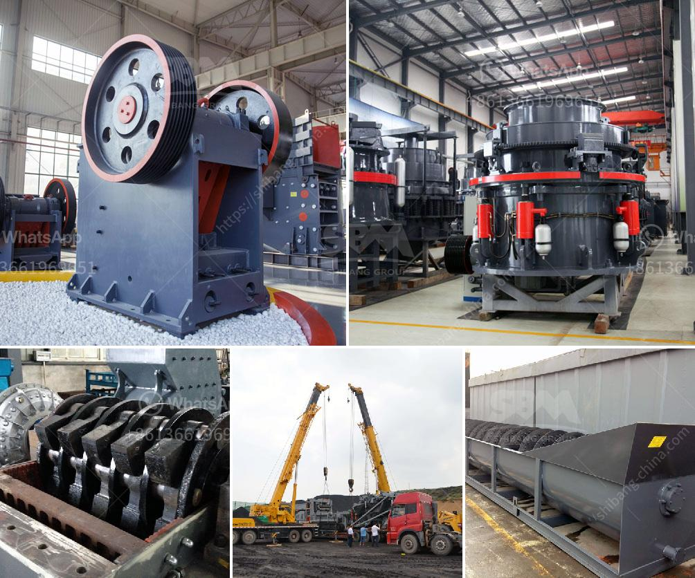

<h3>grinding lm vertical mill</h3>
Grinding is an essential process in various industries where raw materials need to be refined into fine particles or powders. One popular equipment used for this purpose is the LM vertical mill. This innovative grinding machine, developed by our reliable manufacturers, offers numerous advantages over its counterparts.

The LM vertical mill is designed to grind different types of materials efficiently. Its unique grinding roller design and multiple grinding paths ensure that the raw materials are evenly and effectively ground. Additionally, the mill can handle a wide range of particle sizes from coarse to ultra-fine, making it suitable for a variety of applications.

One significant advantage of the LM vertical mill is its energy efficiency. Compared to traditional grinding mills, this equipment consumes less energy, which leads to reduced operating costs. The advanced technology employed in this mill also minimizes noise and vibration, creating a more comfortable and productive working environment.

Another notable feature of the LM vertical mill is its high reliability. The durable components and robust construction ensure long-lasting performance with minimal maintenance requirements. Its solid and ergonomic design makes it easy to operate and maintain, contributing to increased productivity and reduced downtime.

The LM vertical mill can be utilized in various industries, including cement, mining, chemical, and power. Its versatility enables manufacturers to grind a wide range of materials, such as limestone, gypsum, coal, and more, into fine powders, contributing to the efficiency and quality of their end products.

To summarize, the LM vertical mill is an efficient and reliable grinding machine suitable for various industries. Its advanced features, such as energy efficiency, reliability, and versatility, make it a valuable asset for manufacturers looking to enhance their grinding processes. With its exceptional performance and low operating costs, the LM vertical mill is a popular choice for businesses in need of high-quality grinding solutions.
<h3>Contact us</h3><ul><li><strong>Whatsapp:&nbsp;<a href="https://wa.me/8613661969651">+8613661969651</a></strong></li><li><a href="https://swt.shibang-china.com/?git&amp;zhl&amp;grinding lm vertical mill"><strong>Online Service(chat now)</strong></a></li></ul><h3>Related</h3><ul><li><a href='south africa coal mining cost per ton.md'>south africa coal mining cost per ton</a></li><li><a href='crushed crusher price.md'>crushed crusher price</a></li><li><a href='ultrafine mill crusher price in india.md'>ultrafine mill crusher price in india</a></li><li><a href='second hand small cement mill in uae.md'>second hand small cement mill in uae</a></li><li><a href='ball grinding machine manufacturer in india.md'>ball grinding machine manufacturer in india</a></li></ul>