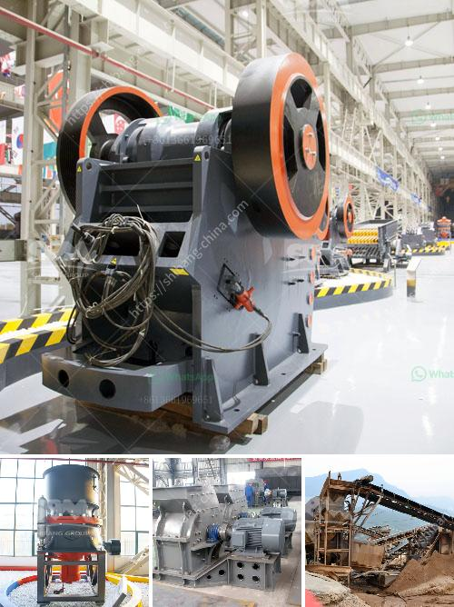

<h3>grinding machine 2 micron for calcium carbonate</h3>
Grinding machines are the tools used in various industries for grinding materials such as rocks, minerals, and metals. In the manufacturing sector, grinding machines are responsible for producing high-quality finishes and accurate cuts. One such grinding machine is the 2-micron-sized calcium carbonate grinding machine.

Calcium carbonate is a material that is used in a wide variety of applications, including in the construction industry as a building material, in the paper industry as a filler, and in the manufacturing of pharmaceuticals and cosmetics. To achieve the desired particle size and shape for these applications, a grinding machine is necessary.

The 2-micron calcium carbonate grinding machine is specially designed for producing fine powder particles. It can be used in the range of 2 microns to 20 microns, depending on the application and the desired particle size. The machine utilizes high speed and sharp grinding blades to crush the calcium carbonate into small particles.

This grinding machine is highly efficient and can produce ultra-fine particles within a short period. It is equipped with advanced technology and features, such as automatic operation, precise control of particle size, and adjustable grinding speed. These features make the machine highly versatile and suitable for a wide range of applications.

One of the key features of the 2-micron calcium carbonate grinding machine is its ability to produce a uniform particle size distribution. This is crucial in many applications where a consistent and homogeneous product is required. The machine ensures that all particles have the same size, shape, and composition, resulting in a product with excellent quality and performance.

Moreover, the machine is designed to minimize the generation of heat during the grinding process. Heat generation can lead to the loss of desired properties of the calcium carbonate, such as its brightness and stability. The 2-micron grinding machine employs a cooling mechanism that prevents excessive heat buildup, ensuring that the final product retains its desired characteristics.

In addition to its efficient grinding capabilities, the 2-micron calcium carbonate grinding machine is also known for its low operating costs. The machine is designed to minimize energy consumption and maximize productivity. It is equipped with an energy-efficient motor that consumes less power, reducing electricity costs. Furthermore, the machine requires minimal maintenance, resulting in lower maintenance and repair expenses.

The 2-micron calcium carbonate grinding machine is widely used in various industries, including the paint and coating industry, the plastic industry, and the rubber industry. It is also useful in the production of cement, ceramics, and glass. The machine provides manufacturers with a cost-effective and efficient solution for grinding calcium carbonate to the desired particle size range.

In conclusion, the 2-micron calcium carbonate grinding machine is a versatile and efficient tool for producing fine powder particles. Its advanced features, such as automatic operation, precise control of particle size, and adjustable grinding speed, make it suitable for a wide range of applications. Its low operating costs and minimal maintenance requirements make it an attractive choice for manufacturers seeking to produce high-quality calcium carbonate products.
<h3>Contact us</h3><ul><li><strong>Whatsapp:&nbsp;<a href="https://wa.me/8613661969651">+8613661969651</a></strong></li><li><a href="https://swt.shibang-china.com/?git&amp;zhl&amp;grinding machine 2 micron for calcium carbonate"><strong>Online Service(chat now)</strong></a></li></ul><h3>Related</h3><ul><li><a href='kenya hammer mill is manufactured.md'>kenya hammer mill is manufactured</a></li><li><a href='bimach grinding marble.md'>bimach grinding marble</a></li><li><a href='roller mill vs hammer mill.md'>roller mill vs hammer mill</a></li><li><a href='list of cement plant in india.md'>list of cement plant in india</a></li><li><a href='costruire une machine pour broyer des briques.md'>costruire une machine pour broyer des briques</a></li></ul>