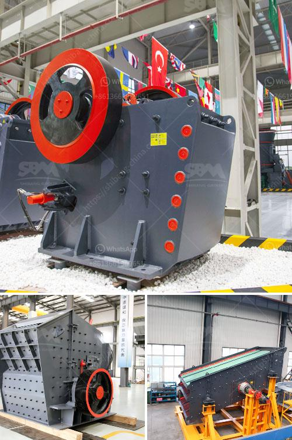

<h3>grinding machine made in turkey</h3>
Turkey is renowned for its rich history, marvelous architecture, and vibrant culture. However, it's not just the historical landmarks that make this country fascinating. Turkey has also emerged as a prominent manufacturer of industrial machinery, including grinding machines.

Grinding machines are widely used in various industries for shaping and finishing metal objects. They are crucial tools in manufacturing, engineering, and fabrication processes. Turkey, with its advanced manufacturing capabilities and skilled workforce, has become a hub for the production of high-quality grinding machines.

One prime example of a top-notch grinding machine made in Turkey is the innovative product offered by XYZ Company. With years of experience in the industry, XYZ has developed a machine that excels in both performance and efficiency. This particular grinding machine utilizes cutting-edge technology to deliver precise results in a variety of applications.

One of the key features of this Turkish-made grinding machine is its versatility. It can handle a wide range of materials, from soft metals to hard alloys, with ease. This makes it an invaluable tool for manufacturers dealing with diverse projects. Whether it's removing excess material, sharpening blades, or simply achieving a smooth surface finish, this machine can deliver outstanding results.

Furthermore, XYZ's grinding machine boasts exceptional precision, thanks to its state-of-the-art control system. With advanced sensors and intuitive software, operators can easily adjust and monitor various parameters to achieve the desired outcome. This level of control ensures consistent quality and reduces the chance of errors or imperfections in the final product.

In addition to its exceptional performance, XYZ's grinding machine also prioritizes operator safety and comfort. It comes equipped with multiple safety features, such as emergency stop buttons, protective enclosures, and user-friendly interfaces. These design elements contribute to a safer working environment, allowing operators to focus on their tasks without unnecessary distractions or risks.

As Turkey continues to strengthen its position in the industrial machinery sector, the production of grinding machines remains a vital component of its manufacturing prowess. With companies like XYZ leading the way, Turkish-made grinding machines are set to carve a niche in the global market. Their commitment to quality, innovation, and customer satisfaction ensures that Turkey remains a reliable source for top-notch industrial machinery.
<h3>Contact us</h3><ul><li><strong>Whatsapp:&nbsp;<a href="https://wa.me/8613661969651">+8613661969651</a></strong></li><li><a href="https://swt.shibang-china.com/?git&amp;zhl&amp;grinding machine made in turkey"><strong>Online Service(chat now)</strong></a></li></ul><h3>Related</h3><ul><li><a href='asphalt crushing machine capacity 15 ton hour.md'>asphalt crushing machine capacity 15 ton hour</a></li><li><a href='dolomite lime manufacturers in ghana.md'>dolomite lime manufacturers in ghana</a></li><li><a href='stone quarry business proposal crusher machine.md'>stone quarry business proposal crusher machine</a></li><li><a href='small gold crushing plant for sale.md'>small gold crushing plant for sale</a></li><li><a href='portable copper ore processing machines in usa.md'>portable copper ore processing machines in usa</a></li></ul>