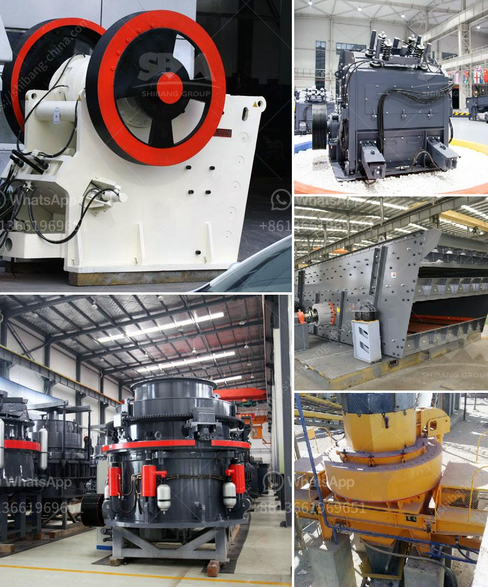

<h3>grinding machinery for sale in guatemala</h3>
In the bustling industrial sector of Guatemala, the demand for grinding machinery has surged. As various industries strive for excellence in the production of quality goods, the need for high-performance equipment has become essential. Grinding machinery plays a pivotal role in the manufacturing process by ensuring the precise shaping and finishing of materials. With a wide range of machinery available in the market, Guatemala offers a myriad of options for businesses seeking to invest in grinding equipment.

Guatemala, with its flourishing manufacturing sector, caters to industries such as automotive, aerospace, construction, and agriculture, among others. In order to maintain a competitive edge, businesses need machinery that delivers accurate results efficiently. Grinding machinery has become a critical component of modern manufacturing processes, allowing for the refinement of materials with precision and consistency.

One of the key benefits of investing in grinding machinery is its ability to enhance productivity. With the advancement of technology, manufacturers have developed cutting-edge machinery that offers high-speed operations without compromising on precision. By automating the grinding process, businesses can significantly reduce production time, thereby increasing output and meeting customer demands with ease.

Furthermore, the quality of the final product is greatly influenced by the accuracy and precision of grinding machinery. In Guatemala, businesses can find a wide range of grinding machines designed to meet specific industry requirements. From surface grinders to cylindrical grinders, these machines offer versatility in shaping and finishing materials such as metal, wood, and plastic. Consistent precision ensures that the final product meets the desired specifications, leading to customer satisfaction and increased market competitiveness.

In addition to precision and productivity, economic factors also drive the demand for grinding machinery in Guatemala. With the aim to minimize costs and maximize efficiency, businesses are inclined to invest in machinery that optimizes operations. The availability of grinding machinery for sale in Guatemala presents an opportunity for businesses to acquire high-quality equipment at competitive prices. This not only helps in cost management but also enables businesses to allocate resources to other crucial aspects of their operations.

When considering purchasing grinding machinery in Guatemala, businesses should prioritize factors such as the reputation of the manufacturer, customer support services, and the availability of spare parts. Collaborating with trusted manufacturers ensures the reliability and durability of the machinery, minimizing the risk of breakdowns and subsequent interruptions in production.

Moreover, businesses should also consider the specific features required for their operations. Whether it is flat or cylindrical grinding, automatic or manual operation, or the need for advanced software integration, it is crucial to evaluate and determine the most suitable machinery for individual manufacturing processes.

In conclusion, the demand for grinding machinery in Guatemala is growing rapidly due to its ability to enhance productivity, ensure precision, and optimize costs. With a wide variety of machinery options available in the market, businesses can find equipment tailored to their specific industry needs. By investing in high-performance grinding machinery, businesses in Guatemala can maximize their manufacturing capabilities, meet customer demands, and remain competitive in the global market.
<h3>Contact us</h3><ul><li><strong>Whatsapp:&nbsp;<a href="https://wa.me/8613661969651">+8613661969651</a></strong></li><li><a href="https://swt.shibang-china.com/?git&amp;zhl&amp;grinding machinery for sale in guatemala"><strong>Online Service(chat now)</strong></a></li></ul><h3>Related</h3><ul><li><a href='cement manufacturing process flow chart.md'>cement manufacturing process flow chart</a></li><li><a href='crush granite machine.md'>crush granite machine</a></li><li><a href='crushing and screening plant supplier china.md'>crushing and screening plant supplier china</a></li><li><a href='zinc ore suppliers in south africa.md'>zinc ore suppliers in south africa</a></li><li><a href='stone crusher machine sale nederland.md'>stone crusher machine sale nederland</a></li></ul>