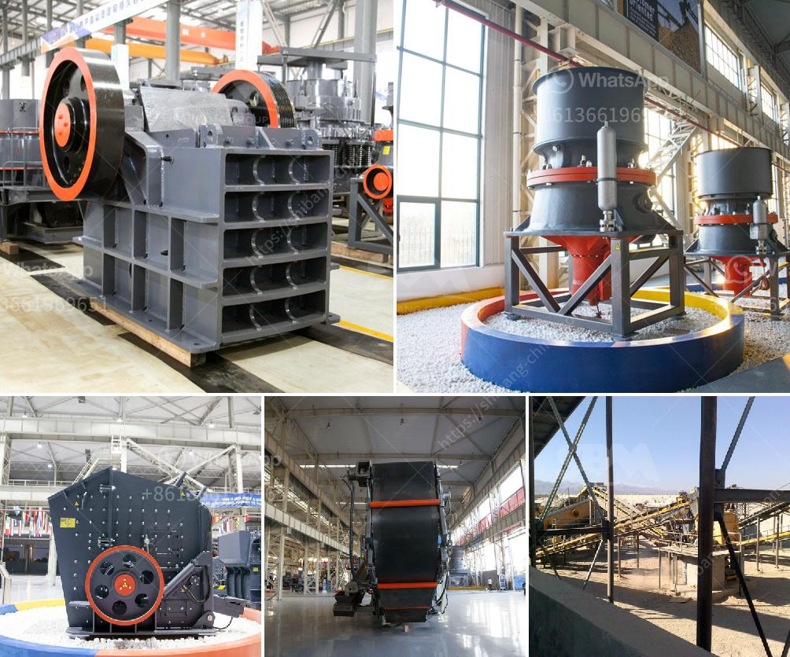

<h3>grinding media balls turkey</h3>
Turkey's industrial and manufacturing sector is diverse and vibrant, encompassing various industries such as mining, cement, and energy. Within these sectors, the importance of grinding media balls cannot be understated. Grinding media balls are used to grind raw materials into fine particles in ball mills, which are widely employed in these industries.

Turkey, with its rich mineral resources, has a significant mining industry that contributes to its economy. To extract precious minerals, the mining process involves crushing and grinding raw materials into smaller, more manageable sizes. Grinding media balls play a crucial role in this step of the process, as they are responsible for breaking down and reducing the size of the materials.

In the cement industry, grinding media balls are used in ball mills to grind clinker and other materials for the production of cement. The grinding process is essential in achieving the desired properties and quality of the final product. Grinding media balls provide the necessary impact and pressure required to crush and grind clinker into fine powder.

The energy sector in Turkey is another major consumer of grinding media balls. In this industry, grinding media balls are used in ball mills to finely grind various types of coal before it is used for power generation. The grinding efficiency of the ball mills is greatly enhanced by the presence of grinding media balls, which help in maximizing the output and reducing energy consumption.

For a long time, Turkey has relied on imported grinding media balls to meet its industrial needs. However, with the growth of the local manufacturing sector, Turkey has taken steps to develop its own grinding media ball manufacturing capabilities. This has led to the establishment of several grinding media ball manufacturing companies in the country.

By producing grinding media balls locally, Turkey not only reduces its dependence on imports but also boosts domestic manufacturing and creates employment opportunities. The local production of grinding media balls ensures a steady supply of this critical component, promoting the smooth operation of various industries that rely on ball mills for their grinding needs.

Moreover, producing grinding media balls locally allows for customization and quality control. Manufacturers can adapt the composition, hardness, and size of the grinding media balls according to the specific requirements of different industries, optimizing their efficiency and performance.

In conclusion, grinding media balls play a vital role in Turkey's industrial and manufacturing sector, particularly in the mining, cement, and energy industries. Turkey's efforts to develop its own grinding media ball manufacturing capabilities highlight the country's commitment to promoting its domestic manufacturing sector and reducing imports. By producing grinding media balls locally, Turkey can ensure a reliable supply of this critical component and enhance the efficiency and effectiveness of its industrial and manufacturing processes.
<h3>Contact us</h3><ul><li><strong>Whatsapp:&nbsp;<a href="https://wa.me/8613661969651">+8613661969651</a></strong></li><li><a href="https://swt.shibang-china.com/?git&amp;zhl&amp;grinding media balls turkey"><strong>Online Service(chat now)</strong></a></li></ul><h3>Related</h3><ul><li><a href='barite powder mill in india.md'>barite powder mill in india</a></li><li><a href='sand stone quarry mining.md'>sand stone quarry mining</a></li><li><a href='200 tph stone crusher price.md'>200 tph stone crusher price</a></li><li><a href='ton per hour hammer mill grinding mill china.md'>ton per hour hammer mill grinding mill china</a></li><li><a href='grinding lm vertical mill.md'>grinding lm vertical mill</a></li></ul>