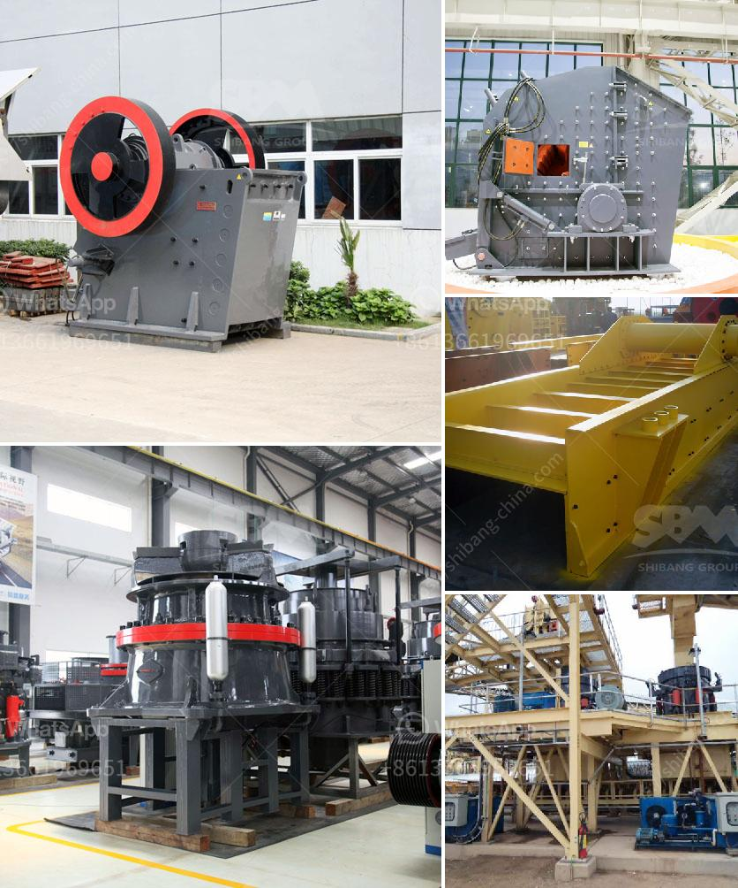

<h3>grinding media charge calculation in cement ball mills</h3>
In grinding the mills are equipped with steel balls of various sizes which act as grinding media. The purpose of the ball mill is to pulverize the ore particles by grinding them to achieve the desired size. A grinding mill essentially consists of a horizontal cylindrical shell, partially filled with grinding media such as ceramic or metallic balls. The grinding media is the balls which may be made of steel, stainless steel, ceramic, or rubber. The inner surface of the cylindrical shell is usually lined with an abrasion-resistant material such as manganese steel or rubber to prevent wear of the mill shell.

1. The first step is to determine the type of grinding media used, such as steel balls, ceramic balls, or a mixture of both. 

2. The second step is to calculate the volume of grinding media required in the mill by considering the grinding efficiency and the mill throughput (capacity). 

Grinding media charge = (volume of grinding media) * (percentage of mill volume occupied by grinding media) * (specific gravity of the grinding media)

The volume of grinding media in a mill is usually expressed as a percentage of the total mill volume. The method for calculating the volume of grinding media differs depending on the type of mill. For example, the volume of grinding media in a ball mill is calculated by adding the total volume of the grinding balls and the interstitial space between them. The interstitial space is defined as the difference between the actual mill volume and the volume occupied by the grinding balls.

The percentage of mill volume occupied by grinding media is typically around 40% to 50% for most ball mills. However, this percentage can vary depending on the type of mill, the size of the grinding media, and the desired fineness of the final product. In general, a higher percentage of grinding media results in faster and more efficient grinding.

Finally, the specific gravity of the grinding media used in the mill must be determined. The specific gravity is a measure of the density of the material relative to the density of water. It is usually expressed in grams per cubic centimeter (g/cm3). The specific gravity of common grinding media such as steel balls is typically around 7.8 g/cm3.

Once the volume of grinding media, the percentage of mill volume occupied by grinding media, and the specific gravity of the grinding media are known, the grinding media charge can be calculated using the formula mentioned earlier.

In conclusion, calculating the grinding media charge in a cement ball mill can be challenging, but the steps outlined above offer a straightforward and reliable approach. By accurately determining the volume of grinding media required, considering the mill capacity and efficiency, and calculating the specific gravity of the grinding media, operators can optimize the grinding process and achieve the desired fineness of the cement product.
<h3>Contact us</h3><ul><li><strong>Whatsapp:&nbsp;<a href="https://wa.me/8613661969651">+8613661969651</a></strong></li><li><a href="https://swt.shibang-china.com/?git&amp;zhl&amp;grinding media charge calculation in cement ball mills"><strong>Online Service(chat now)</strong></a></li></ul><h3>Related</h3><ul><li><a href='equipos para triturado de mineria.md'>equipos para triturado de mineria</a></li><li><a href='beneficiation of iron ore in dry methods.md'>beneficiation of iron ore in dry methods</a></li><li><a href='cement industry process.md'>cement industry process</a></li><li><a href='silica sand production line in german.md'>silica sand production line in german</a></li><li><a href='stone crusher line.md'>stone crusher line</a></li></ul>