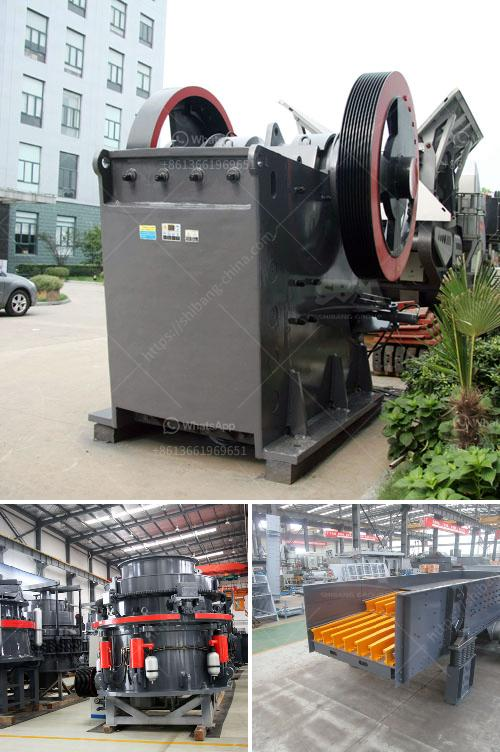

<h3>grinding mill for limestone italy in bergamo</h3>
Located in the picturesque city of Bergamo in Northern Italy lies a hidden gem that has been pivotal in the development of the region - a grinding mill for limestone. This remarkable industrial structure has played a vital role in Italy's rich history, offering a steady supply of high-quality limestone to sustain various sectors such as construction, agriculture, and even art. Let's delve into the significance of this mill and how it has unlocked Italy's potential in harnessing its abundant stone resources.

Firstly, let's address the unique characteristics of limestone and its importance in various industries. Limestone is a sedimentary rock composed mainly of calcium carbonate, making it an excellent choice for construction materials due to its durability and versatility. Furthermore, its natural beauty and unique patterns have made it a prized choice for ornamental purposes, evident in the famous sculptures and architectural masterpieces found throughout Italy.

Italy boasts an abundance of limestone deposits, especially in the Bergamo region. The city's grinding mill serves as a central hub for processing these raw materials, transforming them into fine powders that can be readily utilized across a range of industries. The primary function of the grinding mill is to crush and grind large chunks of limestone into smaller particles, allowing for easier handling and transportation.

One notable application of limestone is in the construction industry. The crushed limestone acts as a vital component in the production of concrete, providing strength and stability to structures. Moreover, limestone powders are incorporated into mortars and plasters, enhancing their workability and aesthetic appeal. Thanks to the grinding mill in Bergamo, Italy has been able to meet the demands of its booming construction sector, ensuring the availability of high-quality limestone for both new constructions and renovations.

Apart from construction, the agricultural industry greatly benefits from the grinding mill's production of limestone powders. These powders, when applied to acidic soils, effectively neutralize the pH levels, making the land suitable for crop cultivation. Italy's fertile lands have thrived through the use of limestone amendments, ensuring optimal conditions for agricultural productivity and bolstering the country's agriculture sector.

Furthermore, the art and sculpture industry have capitalized on the grinding mill's output. Artists and sculptors widely appreciate the intricate patterns and textures of Italian limestone, using it as a canvas for their creative expressions. With the steady supply of finely ground limestone, painters can produce pigments, while sculptors can carve masterpieces from this versatile stone.

In conclusion, the grinding mill for limestone in Bergamo, Italy, stands as a testament to the country's rich resources and industrial heritage. Through its functions, Italy has harnessed the vast potential of limestone in sustaining sectors such as construction, agriculture, and art. This critical infrastructure allows for the efficient processing of limestone, unlocking the natural beauty and versatility of this remarkable stone. As we appreciate the seamless blend between historical significance and modern functionality, we acknowledge the pivotal role played by the grinding mill in Italy's thriving economy and cultural landscape.
<h3>Contact us</h3><ul><li><strong>Whatsapp:&nbsp;<a href="https://wa.me/8613661969651">+8613661969651</a></strong></li><li><a href="https://swt.shibang-china.com/?git&amp;zhl&amp;grinding mill for limestone italy in bergamo"><strong>Online Service(chat now)</strong></a></li></ul><h3>Related</h3><ul><li><a href='kaolin processing line.md'>kaolin processing line</a></li><li><a href='gold mining equipments manufacturers.md'>gold mining equipments manufacturers</a></li><li><a href='slag grindimg in ball mill.md'>slag grindimg in ball mill</a></li><li><a href='precipitated calcium carbonate plant in bangladesh.md'>precipitated calcium carbonate plant in bangladesh</a></li><li><a href='aggregate crushing machines.md'>aggregate crushing machines</a></li></ul>