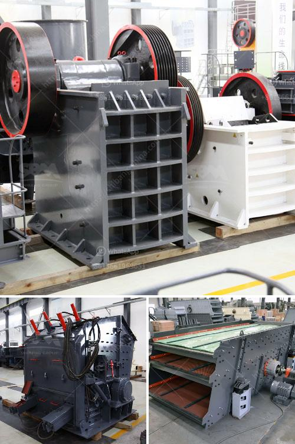

<h3>grinding mill machine price in namibia</h3>
When it comes to agriculture and industrial processes, grinding mills play a crucial role in transforming raw materials into finished products. In Namibia, a country known for its vast agricultural lands and thriving mining industry, the demand for grinding mill machines has been steadily increasing. As a result, understanding the pricing dynamics of these machines becomes essential for businesses and investors alike.

The price of grinding mill machines in Namibia can vary depending on various factors. One influential factor is the capacity of the machine, which refers to the quantity of material it can process within a specific time frame. Machines with higher capacities tend to have a higher price tag due to their ability to handle larger volumes of materials, resulting in increased productivity.

Another factor that affects the price is the type of grinding mill machine. Namibia offers a wide range of options, including hammer mills, ball mills, pin mills, and roller mills. Each type has its unique advantages and applications, making the selection process crucial. Naturally, machines with advanced features and superior technology tend to come at a higher price.

The brand and reputation of the manufacturer also influence the pricing of grinding mill machines in Namibia. Well-established brands with a history of producing high-quality machines tend to charge more for their products. However, investing in well-known brands can offer long-term benefits, such as enhanced durability and reliable after-sales support.

Additionally, the accessibility of spare parts and maintenance services can impact the overall price of grinding mill machines. Namibia, being a developing country, may face challenges when it comes to the availability of these resources. This can potentially lead to higher prices, as importing spare parts and arranging maintenance services may incur additional costs.

To explore the best prices for grinding mill machines in Namibia, consulting multiple suppliers is crucial. This allows potential buyers to compare prices and negotiate for better deals. Furthermore, staying up-to-date with market trends and technological advancements can offer insights into pricing dynamics and assist in making informed purchasing decisions.

In conclusion, the price of grinding mill machines in Namibia is influenced by several factors, including capacity, type, brand, and availability of spare parts. Thus, it is important for businesses and investors to carefully assess their requirements and conduct thorough research before making a purchase. Investing in the right machine at the right price can unlock the potential for increased productivity and profitability in Namibia's agricultural and industrial sectors.
<h3>Contact us</h3><ul><li><strong>Whatsapp:&nbsp;<a href="https://wa.me/8613661969651">+8613661969651</a></strong></li><li><a href="https://swt.shibang-china.com/?git&amp;zhl&amp;grinding mill machine price in namibia"><strong>Online Service(chat now)</strong></a></li></ul><h3>Related</h3><ul><li><a href='kenya mobile crusher philippines.md'>kenya mobile crusher philippines</a></li><li><a href='found stone crusher in davao.md'>found stone crusher in davao</a></li><li><a href='price of industrial conveyor belt for sale.md'>price of industrial conveyor belt for sale</a></li><li><a href='different ore beneficiation equipment all over the world.md'>different ore beneficiation equipment all over the world</a></li><li><a href='zimbabwe hammer mills.md'>zimbabwe hammer mills</a></li></ul>