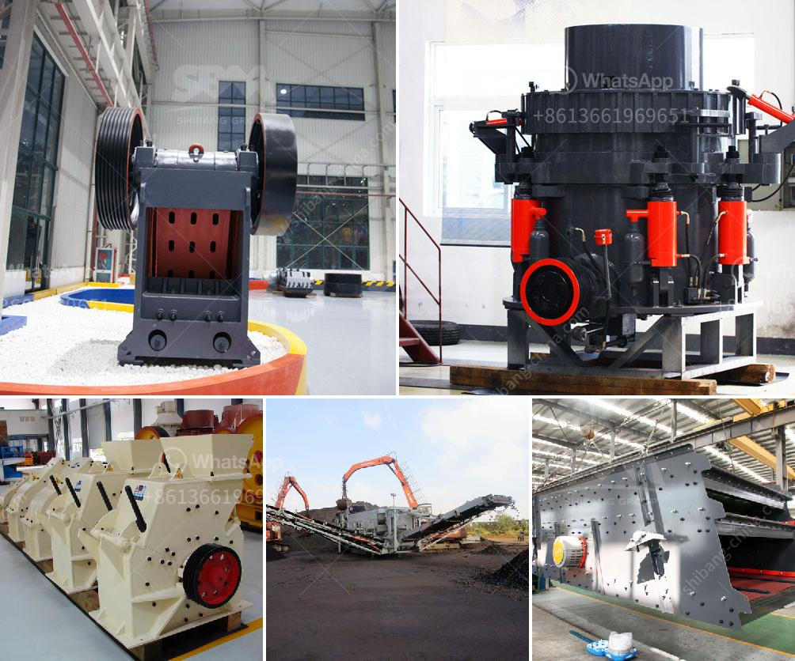

<h3>grinding mill spare parts manufacturers china</h3>
China is known for its manufacturing prowess and is a prime destination for businesses looking for high-quality products at competitive prices. This is no different when it comes to grinding mill spare parts. With a vast number of manufacturers spread across the country, China offers a wide range of options for businesses and industries seeking reliable and cost-effective solutions.

The demand for grinding mill spare parts is constantly increasing due to the expansion of industries such as mining, construction, and material processing. These industries heavily rely on grinding mills to convert raw materials into desired products or materials of consistent quality. However, frequent operation and the abrasive nature of the materials being processed results in the wear and tear of critical parts of these mills, necessitating the need for reliable spare parts manufacturers.

China, being the world's largest producer and consumer of many industrial products, naturally has a substantial number of manufacturers specializing in grinding mill spare parts. These manufacturers are known for their expertise, advanced manufacturing techniques, and commitment to quality control. They employ skilled engineers and technicians who understand the intricacies of grinding mill components and are capable of producing spare parts that meet or exceed the original equipment manufacturer's (OEM) specifications.

Moreover, these manufacturers use high-quality materials sourced from reputable suppliers. Steel, cast iron, and alloy materials are commonly used for manufacturing grinding mill spare parts due to their strength and durability. China's vast network of steel mills and foundries ensures a steady supply of quality raw materials at competitive prices.

In addition to material quality, grinding mill spare parts manufacturers in China are also known for their innovative designs. Continuous research and development efforts allow them to improve the performance and longevity of their products. By incorporating advanced technologies and materials, these manufacturers develop spare parts that offer enhanced wear resistance, reduced maintenance, and increased efficiency.

Affordability is another significant advantage of sourcing grinding mill spare parts from China. The country's robust manufacturing infrastructure, economies of scale, and efficient supply chain management contribute to competitive pricing. Furthermore, Chinese manufacturers are often willing to work closely with customers to provide tailor-made solutions that suit their specific needs and budgets.

When seeking grinding mill spare parts manufacturers in China, it is crucial to ensure that they adhere to international standards and regulations. Look for manufacturers with ISO 9001 certification, which guarantees adherence to strict quality management systems. Additionally, inquire about their production capacity, lead times, and after-sales service to assess their reliability and ability to meet your requirements.

In conclusion, China's grinding mill spare parts manufacturers are a reliable and cost-effective source for businesses and industries in need of high-quality components. Their expertise, use of quality materials, and commitment to innovation ensures that customers receive durable and efficient spare parts for their grinding mills. With competitive pricing and a willingness to provide customized solutions, these manufacturers are a reliable partner for industries seeking to optimize their grinding processes and minimize downtime.
<h3>Contact us</h3><ul><li><strong>Whatsapp:&nbsp;<a href="https://wa.me/8613661969651">+8613661969651</a></strong></li><li><a href="https://swt.shibang-china.com/?git&amp;zhl&amp;grinding mill spare parts manufacturers china"><strong>Online Service(chat now)</strong></a></li></ul><h3>Related</h3><ul><li><a href='crusher machine tanzania.md'>crusher machine tanzania</a></li><li><a href='nigeira mobile crushing plant.md'>nigeira mobile crushing plant</a></li><li><a href='stone aggregate crusher.md'>stone aggregate crusher</a></li><li><a href='ultra grinder service center mumbai.md'>ultra grinder service center mumbai</a></li><li><a href='layoutde a crusher machine.md'>layoutde a crusher machine</a></li></ul>