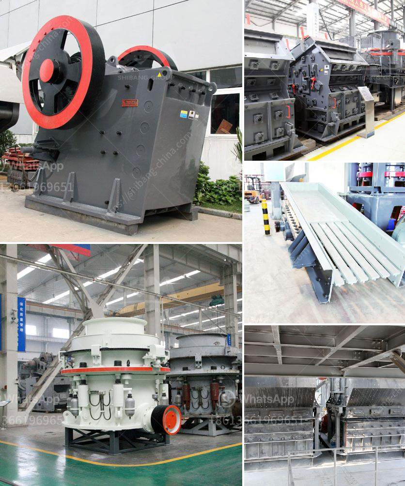

<h3>grinding mills for ore</h3>
Grinding mills play a vital role in the mining and processing of ore, ensuring efficiency by breaking down the ore into smaller pieces. These mills are designed to accommodate different capacities and sizes of raw material and are used for a wide range of applications in the mining industry. This article will explore the significance of grinding mills for ore processing and highlight some of the common types available in the market.

One of the primary functions of grinding mills is to break down ore into smaller pieces for further processing. This process is known as comminution, and it is essential for extracting valuable minerals and metals from the ore. By reducing the ore to smaller fragments, grinding mills increase the surface area available for chemical reactions, making it easier to extract desired elements.

The most common types of grinding mills used in mining operations include ball mills, rod mills, autogenous (AG) mills, and semi-autogenous (SAG) mills. Each type has different applications, but they all work by grinding the ore through a rotating drum or cylinder.

Ball mills are the most frequently used grinding mills in the mining industry. They have a simple design, consisting of a rotating drum with grinding media (steel balls or rods) inside. The ore is fed into the drum, and as the drum rotates, the grinding media crushes and grinds the ore into smaller particles. Ball mills are efficient for fine grinding, but they can also be used for coarse grinding when needed.

Rod mills are similar to ball mills, but instead of using grinding media, they use long steel rods to grind the ore. These rods are placed inside the cylinder, causing them to tumble and break the ore into smaller particles. Rod mills are generally more efficient for coarse grinding and often used in the early stages of ore processing.

Autogenous (AG) mills and semi-autogenous (SAG) mills are larger versions of ball mills and rod mills, capable of handling larger quantities of ore. In AG mills, the ore itself acts as the grinding media, while in SAG mills, a combination of ore and additional grinding media (such as steel balls or rods) helps to break down the ore. These mills are often used for primary grinding and can process large amounts of ore in a single operation.

Grinding mills for ore are designed to accommodate various capacities, ranging from a few tons to hundreds of tons per hour, depending on the mill size and its processing capabilities. Higher-capacity mills are often used in large mining operations, where significant amounts of ore need to be processed onsite.

In conclusion, grinding mills play a crucial role in ore processing, breaking down ore into smaller particles to facilitate further extraction of valuable minerals and metals. Various types of mills, such as ball mills, rod mills, AG mills, and SAG mills, cater to different capacity and processing requirements. These mills offer efficient and cost-effective solutions for grinding ore and are widely used in the mining industry.
<h3>Contact us</h3><ul><li><strong>Whatsapp:&nbsp;<a href="https://wa.me/8613661969651">+8613661969651</a></strong></li><li><a href="https://swt.shibang-china.com/?git&amp;zhl&amp;grinding mills for ore"><strong>Online Service(chat now)</strong></a></li></ul><h3>Related</h3><ul><li><a href='italy stone crusher manufacter.md'>italy stone crusher manufacter</a></li><li><a href='jaw plate for jaw crusher breaker.md'>jaw plate for jaw crusher breaker</a></li><li><a href='business plan for sand making machine.md'>business plan for sand making machine</a></li><li><a href='roller mill for dolmite.md'>roller mill for dolmite</a></li><li><a href='cost of stone crusher plant in saudi.md'>cost of stone crusher plant in saudi</a></li></ul>