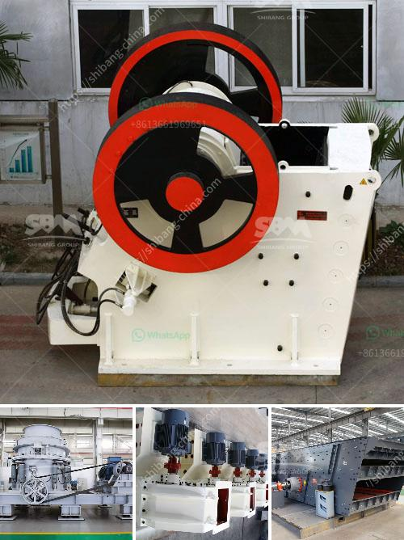

<h3>grinding mills supplier in gujraanwala</h3>
Gujranwala, a bustling industrial city in Pakistan's Punjab province, is renowned for its growing manufacturing sector. The city is home to a wide range of industries, including textile, ceramics, pharmaceuticals, and food processing. One crucial component that aids these industries in their production processes is grinding mills. Grinding mills play a significant role in reducing raw material size and transforming them into usable materials for various industrial applications. In Gujranwala, there are numerous grinding mills suppliers catering to the increasing demands of the industry.

Grinding mills manufacturers in Gujranwala provide a comprehensive range of mills that cater to different industries' needs. These mills are specially designed to grind and pulverize various materials, such as minerals, industrial chemicals, ores, paints, and ceramic raw materials. The primary purpose of these mills is to reduce the size of the materials, ensuring their suitability for further processing and utilization in end products.

One of the reputable grinding mills suppliers in Gujranwala is XYZ Industries. XYZ Industries has been operating in the region for over two decades and has gained a strong reputation for its quality products and reliable services. The company offers a diverse range of grinding mills that cater to different industries. Whether it is the pharmaceutical sector seeking fine grinding of chemicals or the ceramic industry requiring precise and homogeneous particle size reduction, XYZ Industries has a solution for every need.

The grinding mills supplied by XYZ Industries are equipped with advanced technology and cutting-edge features that ensure optimal performance and efficiency. These mills come in various capacities and sizes, allowing customers to choose the one that best suits their requirements. Additionally, the mills are designed to be energy-efficient, reducing power consumption and minimizing operational costs for industries.

Quality is a crucial aspect when it comes to grinding mills supplier selection, as it directly affects the end products' quality and consistency. XYZ Industries prioritizes quality in every aspect of their operations. The grinding mills manufactured by the company undergo rigorous quality control processes, ensuring that they meet the highest standards. The company also uses high-quality materials and components in the manufacturing process to enhance the mills' durability and longevity.

XYZ Industries understands the importance of after-sales service and customer support. The company has a team of experienced technicians and engineers who provide timely maintenance, repair, and support services to customers. This ensures that the grinding mills continue to operate at their peak efficiency, minimizing any downtime that could hinder the production processes of industries reliant on these mills.

In conclusion, grinding mills suppliers in Gujranwala play a crucial role in meeting the demands of the growing industrial sector in the region. These suppliers, such as XYZ Industries, offer a wide range of high-quality grinding mills that cater to different industries' needs. With advanced technology, energy efficiency, and a commitment to quality, these suppliers ensure that industries in Gujranwala continue to thrive and meet the ever-increasing demands of the market.
<h3>Contact us</h3><ul><li><strong>Whatsapp:&nbsp;<a href="https://wa.me/8613661969651">+8613661969651</a></strong></li><li><a href="https://swt.shibang-china.com/?git&amp;zhl&amp;grinding mills supplier in gujraanwala"><strong>Online Service(chat now)</strong></a></li></ul><h3>Related</h3><ul><li><a href='belt conveyor manufacturers in indonesia.md'>belt conveyor manufacturers in indonesia</a></li><li><a href='used gypsum plant for sale europe.md'>used gypsum plant for sale europe</a></li><li><a href='japan used rolling mill.md'>japan used rolling mill</a></li><li><a href='ball mill for mineral grinding india.md'>ball mill for mineral grinding india</a></li><li><a href='silica processing company.md'>silica processing company</a></li></ul>