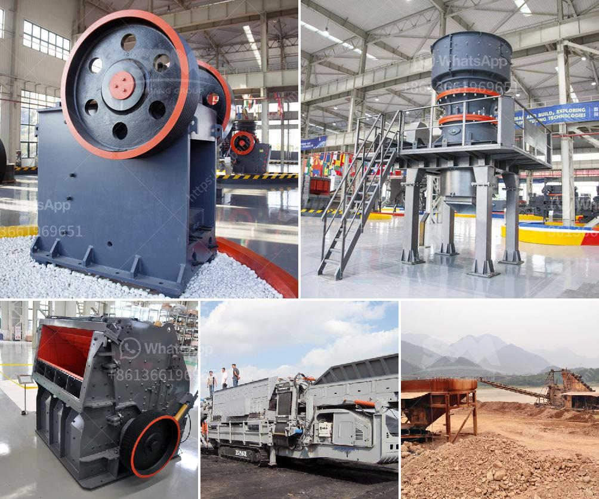

<h3>grinding plant material gold</h3>
Gold extraction has long been associated with mining and ore-processing industries. However, recent advancements have unveiled a novel technique that involves grinding plant materials for efficient extraction of gold particles. This article examines the process, advantages, and potential challenges of grinding plant material to retrieve gold.

Traditionally, gold is extracted through processes like cyanidation, amalgamation, and smelting. These techniques often involve the use of toxic chemicals and high energy consumption. Additionally, they are primarily applied to extracting gold from ores or mining tailings. However, with dwindling ore resources and increasing environmental concerns, researchers have turned their attention towards alternative sources for gold extraction.

The idea of grinding plant materials primarily stems from the fact that some plants are known to accumulate gold in their tissues through natural processes. This natural accumulation, though usually in trace amounts, presents an opportunity for gold extraction. By mechanically breaking down the plant material, potential gold particles can be released, facilitating their subsequent recovery.

The grinding process involves the use of specialized equipment that crushes and fractures plant material into smaller particles. This mechanical disruption breaks down cell structures and liberates gold particles that were previously trapped within the plant's tissues. The ground plant material is then subjected to further processing techniques, such as flotation or leaching, to separate and concentrate the gold particles.

Grinding plant material offers several advantages over conventional gold extraction methods. Firstly, it provides an environmentally friendly alternative, as it reduces the reliance on chemical reagents commonly used in traditional extraction processes. Furthermore, grinding plant materials can be performed using relatively low energy inputs, making it a cost-effective method. Additionally, the process can be easily scaled to accommodate different processing capacities, allowing for versatile applications in both large-scale operations and smaller artisanal mining activities.

While grinding plant materials for gold extraction presents a promising approach, several challenges need to be addressed. The primary challenge lies in developing efficient and economically viable methods to separate and recover the gold particles from the resulting ground material. Innovative techniques, such as selective adsorption or magnetic separation, may prove instrumental in achieving this goal.

Moreover, extensive research is necessary to identify plant species that accumulate gold in their tissues and possess high yields for extraction purposes. This knowledge will aid in selecting the most suitable plant materials for gold grinding and optimize the overall extraction process.

Grinding plant material represents a forward-thinking and sustainable approach to extract gold particles. By harnessing the natural gold accumulation found in certain plant species, this method offers a cleaner, cost-effective, and scalable alternative to traditional extraction techniques. Further research and development are crucial to improving the separation and recovery processes, while identifying plant materials with higher gold accumulation rates. With continued advancements in this field, grinding plant material holds the potential to revolutionize gold extraction methods, making them more environmentally friendly and economically feasible for future applications.
<h3>Contact us</h3><ul><li><strong>Whatsapp:&nbsp;<a href="https://wa.me/8613661969651">+8613661969651</a></strong></li><li><a href="https://swt.shibang-china.com/?git&amp;zhl&amp;grinding plant material gold"><strong>Online Service(chat now)</strong></a></li></ul><h3>Related</h3><ul><li><a href='cement manufacturing process flow chart.md'>cement manufacturing process flow chart</a></li><li><a href='financial projection of a quarry business.md'>financial projection of a quarry business</a></li><li><a href='stone crusher machine pr ice in nepal.md'>stone crusher machine pr ice in nepal</a></li><li><a href='mobile crusher 100tph for sale.md'>mobile crusher 100tph for sale</a></li><li><a href='malaysia coconut grinder machine.md'>malaysia coconut grinder machine</a></li></ul>