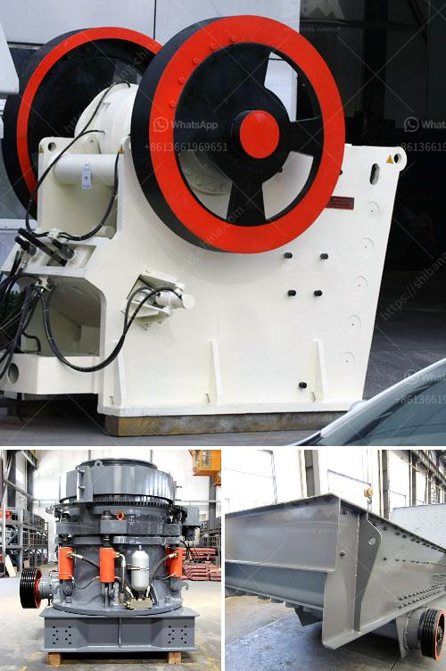

<h3>grinding talcum powder company</h3>
Talcum powder, also known as talc, is a soft and naturally occurring mineral substance that is used in various industries including cosmetics, pharmaceuticals, and more. It is used in these industries mainly due to its ability to absorb moisture, reduce friction, and provide a smooth texture. However, before talc can be used in these industries, it undergoes a process called grinding.

Grinding talcum powder is a complex process that requires a high level of precision, efficiency, and expertise. The first step in the process involves crushing the talc ore into small particles. This is usually done using jaw crushers or hammer mills. Once the talc ore is crushed, it is then transferred to a grinding mill where fine particles are produced using various grinding techniques.

Grinding talcum powder requires specialized equipment such as a Raymond mill, high-pressure suspension roller mill, ultrafine powder grinder, air classifier, and more. These machines work together to achieve the desired particle size distribution and specific surface area of the final product. The grinding process may take several hours, depending on the desired fineness.

One grinding company that specializes in grinding talcum powder is XYZ Grinding Company. With several years of experience in the industry, XYZ Grinding Company has mastered the art of grinding talc to perfection. They have state-of-the-art grinding equipment and a team of skilled professionals who ensure high-quality and consistent talcum powder production.

XYZ Grinding Company prides itself on providing talcum powder that meets the highest industry standards. Their talc powder is finely ground and has a smooth texture, making it ideal for use in a variety of applications. Whether it's for cosmetics, pharmaceuticals, or other industries, XYZ Grinding Company ensures that their talcum powder is of the highest quality.

Additionally, XYZ Grinding Company understands the importance of sustainability and responsible manufacturing practices. They prioritize the use of environmentally friendly grinding techniques and adhere to strict safety regulations to ensure the well-being of their employees and the surrounding community.

Grinding talcum powder is not only a complex process but also poses certain challenges. One major challenge is achieving the desired particle size distribution. The size of talcum powder particles can significantly affect its functionality in various applications. Achieving the desired particle size and distribution requires expertise and proper control over the grinding process.

In conclusion, grinding talcum powder is a critical process that requires precision and expertise. XYZ Grinding Company is a trusted name in the industry, known for producing high-quality talcum powder that meets industry standards. Their commitment to sustainability and responsible manufacturing practices sets them apart from their competitors. With state-of-the-art equipment and a skilled workforce, XYZ Grinding Company is a reliable partner for any company in need of finely ground talc powder.
<h3>Contact us</h3><ul><li><strong>Whatsapp:&nbsp;<a href="https://wa.me/8613661969651">+8613661969651</a></strong></li><li><a href="https://swt.shibang-china.com/?git&amp;zhl&amp;grinding talcum powder company"><strong>Online Service(chat now)</strong></a></li></ul><h3>Related</h3><ul><li><a href='kobe crushers singapore suppliers.md'>kobe crushers singapore suppliers</a></li><li><a href='onsite construction debris recycling machines.md'>onsite construction debris recycling machines</a></li><li><a href='barangay resolution crushing plant.md'>barangay resolution crushing plant</a></li><li><a href='calcium carbonate plant manufacturers.md'>calcium carbonate plant manufacturers</a></li><li><a href='rollers for conveyor belts manizales.md'>rollers for conveyor belts manizales</a></li></ul>