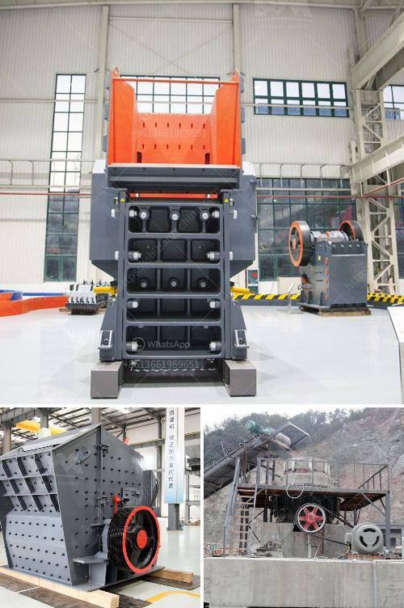

<h3>gypsum board making machinery</h3>
Gypsum board, also known as drywall or plasterboard, is a widely used construction material that provides a smooth finish to interior walls and ceilings. It is made from a mix of gypsum and paper, which are pressed together into thin sheets and then dried to create rigid boards.

To manufacture gypsum boards efficiently, specialized machinery is required. These machines play a crucial role in the production process, enabling manufacturers to produce high-quality boards in a cost-effective manner. Let's take a closer look at the gypsum board making machinery.

The primary equipment used in gypsum board production is the board production line, which consists of several machines working together seamlessly. The first machine in the line is the gypsum grinding mill, which grinds the gypsum into a fine powder. This powder is then conveyed to a mixer, where water is added to create a slurry.

Next, the slurry is poured onto a moving belt, which carries it through a forming unit. This unit contains a moving sieve, which helps to spread the slurry evenly and remove any excess water. As the slurry moves along the belt, a layer of paper is fed into the forming unit, sandwiching the slurry between two layers of paper.

Once the slurry and paper are combined, the continuous board passes through a series of rollers and a shaping machine, which ensure uniform thickness and smooth edges. From there, the board is cut into desired lengths by a cutting machine.

After the boards are cut, they are sent into a drying kiln, where heat is applied to remove any remaining moisture. The final step is the finishing process, where the boards are inspected for quality, sanded if necessary, and then packed for shipping.

Gypsum board making machinery is designed to optimize efficiency and productivity while maintaining consistent quality. Modern machines are equipped with advanced automation features, allowing operators to monitor and control the entire production process. As a result, manufacturers can produce a large volume of gypsum boards in a shorter time frame, reducing costs and meeting the demands of the construction industry.

Overall, gypsum board making machinery plays a crucial role in the production of drywall, enabling manufacturers to produce high-quality boards efficiently and cost-effectively. The continuous advancements in technology and automation are further improving the efficiency and productivity of these machines, ensuring a steady supply of gypsum boards for the construction industry.
<h3>Contact us</h3><ul><li><strong>Whatsapp:&nbsp;<a href="https://wa.me/8613661969651">+8613661969651</a></strong></li><li><a href="https://swt.shibang-china.com/?git&amp;zhl&amp;gypsum board making machinery"><strong>Online Service(chat now)</strong></a></li></ul><h3>Related</h3><ul><li><a href='cobalt mobile crusher.md'>cobalt mobile crusher</a></li><li><a href='blast furnace slag grinding machine india.md'>blast furnace slag grinding machine india</a></li><li><a href='micro crushers plant.md'>micro crushers plant</a></li><li><a href='sand wash plant hire perth.md'>sand wash plant hire perth</a></li><li><a href='stone crusher permission maharashtra.md'>stone crusher permission maharashtra</a></li></ul>