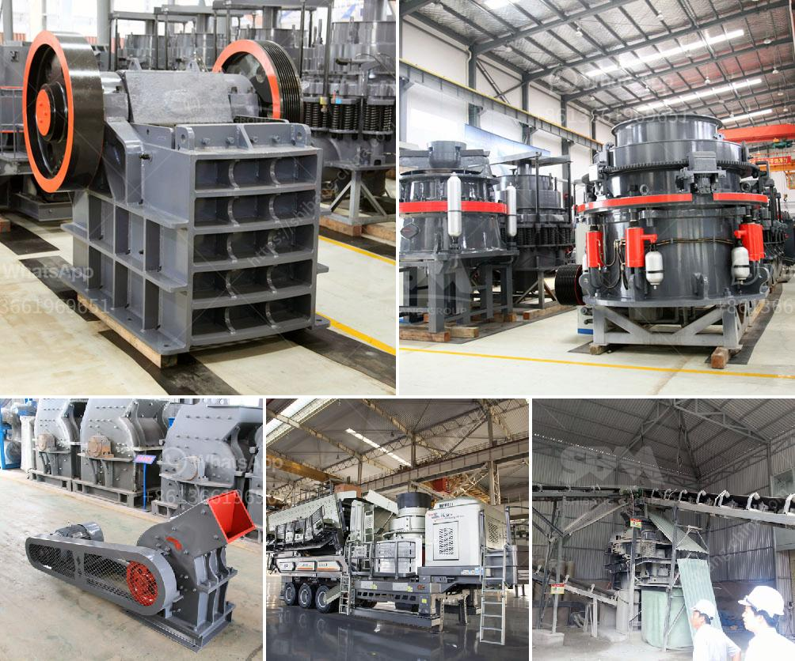

<h3>gypsum board manufacturing factory in turkey</h3>
Gypsum is a mineral compound that is widely used in the construction industry. Its versatile properties make it ideal for various applications, including wall partitions, ceilings, and decorative moldings. Turkey has emerged as one of the leading manufacturers and exporters of gypsum boards, catering to both domestic and international markets. With numerous manufacturing facilities spread across the country, Turkey has solidified its position as a major player in the gypsum board industry.

One of the prominent gypsum board manufacturing factories in Turkey is [Enter Factory Name], located in [Enter Location]. This state-of-the-art facility boasts advanced technology and a highly efficient production process, enabling it to meet the rising demand for gypsum boards.

The factory encompasses a large area, housing cutting-edge machinery and equipment for every stage of production. The gypsum board manufacturing process begins with the extraction of natural gypsum, which is then crushed into smaller pieces. These raw materials are then subjected to the heating process in a kiln, where the moisture content is reduced, transforming the gypsum into a fine powder.

Once the gypsum powder is obtained, it is mixed with water to form a slurry. This slurry is then poured onto a continuous sheet of paper, which acts as a facing material. The slurry-covered paper is then sandwiched between two layers of paper, forming a composite structure. The entire assembly, known as a gypsum board, then passes through a series of rollers to ensure uniform thickness and shape.

The final step involves cutting the gypsum boards into various sizes and shapes, depending on customer requirements. These finished boards are then subjected to careful quality control checks to ensure adherence to industry standards before packaging and distribution.

[Enter Factory Name] takes pride in maintaining high-quality standards throughout the manufacturing process. Stringent quality control measures and regular inspections ensure that only gypsum boards of the finest quality reach the market, gaining the trust of both contractors and end-users.

Besides meeting domestic demand, this factory also serves as an important supplier to international markets. Turkey's strategic geographic location allows for cost-effective transportation to various destinations around the world. Coupled with its high production capacity, the gypsum board manufacturing industry in Turkey has achieved significant export growth in recent years.

Furthermore, sustainability is an integral aspect of the gypsum board manufacturing process in Turkey. The factory strictly adheres to environmentally friendly practices, such as recycling and reusing water, reducing energy consumption, and minimizing waste during the production process. This commitment to sustainable manufacturing has won the factory recognition and certifications for its environmentally responsible practices.

In conclusion, [Enter Factory Name] exemplifies the thriving gypsum board manufacturing industry in Turkey. With its cutting-edge technology, efficient production process, and commitment to quality and sustainability, this factory contributes significantly to meeting the growing demand for gypsum boards both domestically and globally. As Turkey continues to invest in its manufacturing capabilities, the gypsum board industry is poised to experience further growth, solidifying its position as a key player in the construction sector.
<h3>Contact us</h3><ul><li><strong>Whatsapp:&nbsp;<a href="https://wa.me/8613661969651">+8613661969651</a></strong></li><li><a href="https://swt.shibang-china.com/?git&amp;zhl&amp;gypsum board manufacturing factory in turkey"><strong>Online Service(chat now)</strong></a></li></ul><h3>Related</h3><ul><li><a href='gravel crusher price.md'>gravel crusher price</a></li><li><a href='cost of cement clinker grinding unit.md'>cost of cement clinker grinding unit</a></li><li><a href='fly ash processing plant machinery.md'>fly ash processing plant machinery</a></li><li><a href='ball grinding machine manufacturer in india.md'>ball grinding machine manufacturer in india</a></li><li><a href='mobile gold processing 20 tph.md'>mobile gold processing 20 tph</a></li></ul>