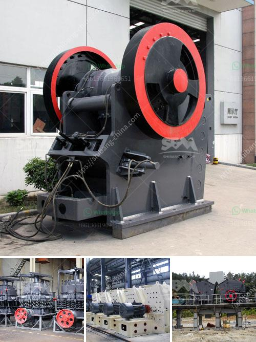

<h3>gypsum board processing machinery</h3>
Gypsum board, also known as drywall or plasterboard, is a common building material used for residential and commercial construction projects. It is widely used for wall and ceiling coverings due to its durability, fire resistance, and ease of installation. The production of gypsum board involves several steps, and the machinery used in each step plays a crucial role in ensuring the high quality of the final product.

The first step in gypsum board production is the mining and extraction of gypsum from quarries or mines. Once the raw material is obtained, it undergoes a crushing and screening process to remove any impurities. This is where gypsum board processing machinery comes into play.

The crushing chamber of the machinery consists of a rotor with hammers, which reduces the size of the gypsum ore to smaller particles. The crushed gypsum is then transferred to a vibrating screen, where any large particles are removed and sent back for further grinding. The smaller particles, usually less than 50mm, are then conveyed to a mill, where they are ground to a fine powder.

After grinding, the powdered gypsum is mixed with water in a mixing tank to form a slurry. This slurry is then poured onto a moving conveyor belt, which is coated with paper or fiberglass. As the belt moves forward, the excess water is drained, and the wet gypsum board starts to take shape.

The wet gypsum board is then covered with another layer of paper or fiberglass on top and bottom to create a sandwich-like structure. The edges of the board are shaped to form a tapered edge, which allows for seamless installation and finishing. The board is cut into specific lengths and transferred to the drying chamber.

The drying chamber is a critical part of the gypsum board processing machinery. It features a continuous conveyor belt that moves the boards through a series of drying ovens. These ovens are heated to high temperatures, typically around 160 degrees Celsius, to remove the excess moisture from the boards. This ensures that the boards are properly dried and ready for further processing.

Once dry, the gypsum boards are inspected for quality control and any defects are repaired. This can involve cutting out damaged sections, filling cracks, or sanding uneven surfaces. After inspection and repair, the boards are packaged and prepared for distribution to construction sites.

In conclusion, the processing of gypsum board involves several steps, each of which requires specialized machinery. From crushing and grinding the raw material to forming and drying the boards, every stage is crucial in producing high-quality gypsum board. The use of advanced gypsum board processing machinery ensures the efficiency and precision of the production process, resulting in durable and reliable building materials for construction projects.
<h3>Contact us</h3><ul><li><strong>Whatsapp:&nbsp;<a href="https://wa.me/8613661969651">+8613661969651</a></strong></li><li><a href="https://swt.shibang-china.com/?git&amp;zhl&amp;gypsum board processing machinery"><strong>Online Service(chat now)</strong></a></li></ul><h3>Related</h3><ul><li><a href='barite and bentonite mining companies.md'>barite and bentonite mining companies</a></li><li><a href='impact crusher from china.md'>impact crusher from china</a></li><li><a href='ball mill for mineral grinding india.md'>ball mill for mineral grinding india</a></li><li><a href='price list of used stone crusher in india.md'>price list of used stone crusher in india</a></li><li><a href='used portable gravel screens for sale.md'>used portable gravel screens for sale</a></li></ul>