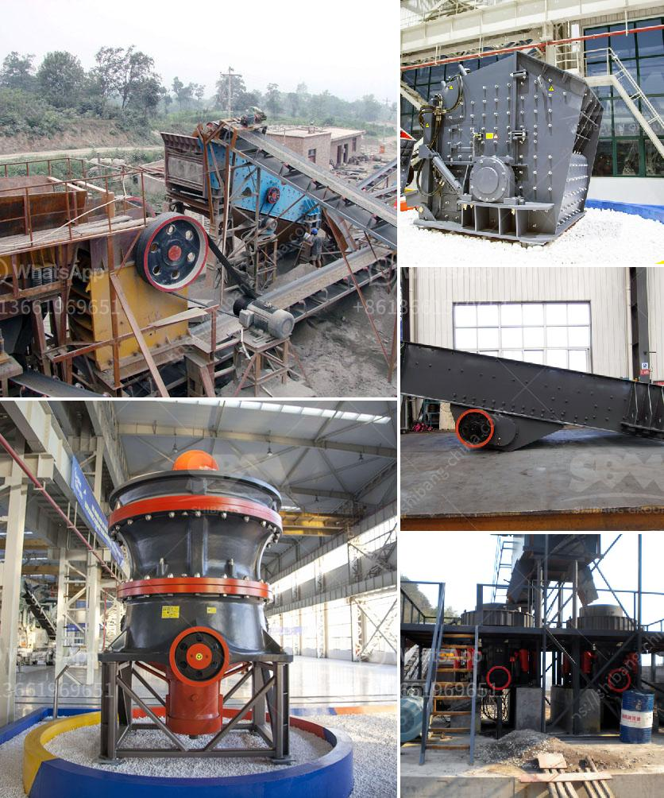

<h3>gypsum crusher machine turkey</h3>
Gypsum, a mineral resource with a variety of uses, has long been considered a valuable commodity in industries such as construction, manufacturing, agriculture, and even medicine. To efficiently process gypsum in Turkey, manufacturers have turned to the use of gypsum crusher machines.

Gypsum, a naturally occurring mineral, is mainly composed of calcium sulfate. When crushed, it forms a fine powder that is widely used in various industrial applications. In the construction industry, gypsum powder is used as a binding material in the production of drywall, plaster and other building materials. Its fire-resistant properties make it an ideal choice for wall and ceiling installations.

Turkey, a country rich in gypsum reserves, has been actively exploring opportunities to enhance its gypsum industry. One of the key steps in achieving this goal is the utilization of advanced machinery to extract and process gypsum. Gypsum crusher machines, as essential equipment for gypsum processing, are incredibly beneficial. They simplify the process of breaking down large-sized gypsum ores into smaller pieces.

- Numerous Turkish companies, known for their expertise in the industry, manufacture gypsum crusher machines and offer them to businesses worldwide. These companies have experienced workers and technicians who understand the unique properties of gypsum and ensure that the machines they produce are of high quality.

- Gypsum crusher machines in Turkey are remarkably designed to be heavy-duty and robust. This ensures that they can handle the demanding tasks required during the crushing process. Their superior durability promises efficient operation, even in challenging environments.

- The machines also prioritize safety. They are equipped with advanced features that prevent accidents, such as overload protection systems and emergency stop buttons. Workers can operate these machines with peace of mind, knowing that their safety is a top priority.

- Turkish gypsum crusher machines are designed to work effectively at various production capacities. They can handle small-scale crushing projects as well as larger-scale operations. This flexibility allows businesses to choose the right machine to match their specific needs and budget.

- Additionally, many Turkish gypsum crusher machines are equipped with automation systems. These systems streamline the production process, reduce manual labor requirements, and enhance overall efficiency. By minimizing human error and accelerating the crushing process, automation systems contribute to increased productivity in gypsum processing plants.

In conclusion, Turkey's gypsum crusher machines play a vital role in extracting and processing gypsum ores efficiently. With their high-quality construction and safety features, these machines enable businesses to maximize their productivity in the gypsum industry. The use of advanced technology and automation systems further contribute to streamlining the production process and enhancing overall efficiency. As Turkey continues to invest in its gypsum industry, these crusher machines will remain essential equipment for its success.
<h3>Contact us</h3><ul><li><strong>Whatsapp:&nbsp;<a href="https://wa.me/8613661969651">+8613661969651</a></strong></li><li><a href="https://swt.shibang-china.com/?git&amp;zhl&amp;gypsum crusher machine turkey"><strong>Online Service(chat now)</strong></a></li></ul><h3>Related</h3><ul><li><a href='project cost of tpd ofcement plant in pakistan.md'>project cost of tpd ofcement plant in pakistan</a></li><li><a href='quartz sand particle size quartz powder.md'>quartz sand particle size quartz powder</a></li><li><a href='mobile gold hammer crusher for sale philippines.md'>mobile gold hammer crusher for sale philippines</a></li><li><a href='kenya hammer mill is manufactured.md'>kenya hammer mill is manufactured</a></li><li><a href='100tph jaw crusher.md'>100tph jaw crusher</a></li></ul>