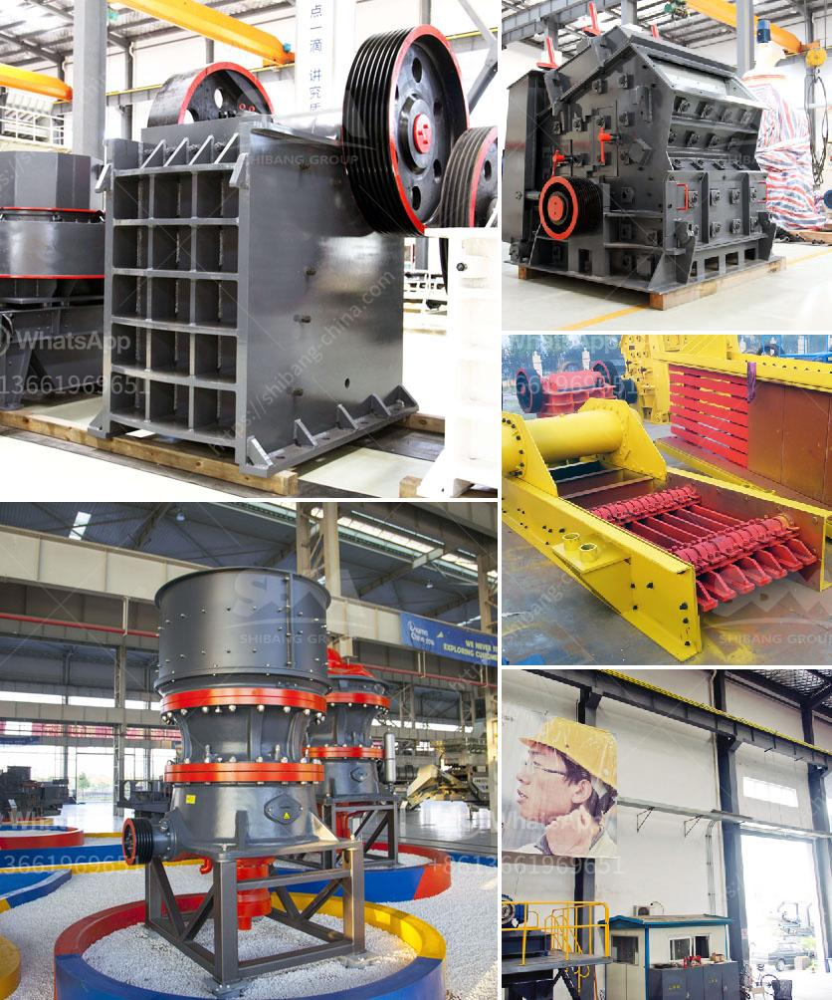

<h3>gypsum crusher specification</h3>
Gypsum is a commonly used mineral in the construction and manufacturing industries. It is used as a raw material for cement production, adding stability and strength to the final product. To make the most of this versatile mineral, gypsum needs to be crushed into a fine powder before it can be used.

This is where a gypsum crusher comes in. With its high crushing efficiency and compact design, the gypsum crusher efficiently reduces the size of gypsum stones. Since gypsum is an abrasive material, it often wears out crushing equipment that does not have wear-resistant parts, resulting in higher maintenance costs. However, a gypsum crusher with wear-resistant parts can effectively solve this problem.

When choosing a gypsum crusher, it is important to consider its specifications. A high-quality gypsum crusher should have a wide range of feed sizes, allowing it to handle both large and small stones. This helps to ensure that the gypsum crusher can effectively meet the production requirements of various applications.

In addition, a gypsum crusher should have a high reduction ratio. This means that it should be able to break down the gypsum stones into smaller pieces with minimal energy consumption. A high reduction ratio not only increases the efficiency of the crusher but also helps to minimize the wear and tear on the equipment.

Another important specification to consider is the power and speed of the crusher. A powerful and fast crusher can effectively crush large quantities of gypsum stones in a shorter period of time. This is particularly important for applications that require a high production rate.

Overall, a gypsum crusher with the right specifications can greatly improve the efficiency and productivity of gypsum processing. By carefully considering factors such as feed size, reduction ratio, power, and speed, you can select the ideal gypsum crusher for your specific needs. This will help you maximize the value and utility of this commonly used mineral in various industries.
<h3>Contact us</h3><ul><li><strong>Whatsapp:&nbsp;<a href="https://wa.me/8613661969651">+8613661969651</a></strong></li><li><a href="https://swt.shibang-china.com/?git&amp;zhl&amp;gypsum crusher specification"><strong>Online Service(chat now)</strong></a></li></ul><h3>Related</h3><ul><li><a href='copper mining equipment suppliers south america.md'>copper mining equipment suppliers south america</a></li><li><a href='granite crusher equipment.md'>granite crusher equipment</a></li><li><a href='jaw plate for jaw crusher breaker.md'>jaw plate for jaw crusher breaker</a></li><li><a href='gold ore crusher for sale.md'>gold ore crusher for sale</a></li><li><a href='plant and machinery of quartz for sale in india.md'>plant and machinery of quartz for sale in india</a></li></ul>