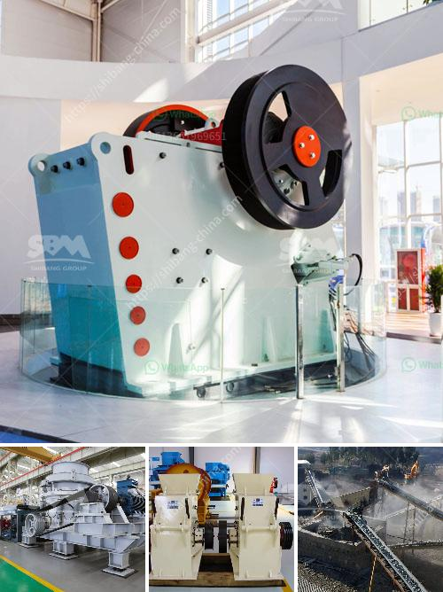

<h3>gypsum crushing making machine south africa</h3>
Gypsum, a mineral abundant in nature, presents numerous uses in various industries. South Africa, being one of the leading mineral producers globally, has a vast deposit of this mineral. This article aims to explore the importance of gypsum crushing making machines in South Africa. These machines enable gypsum to be broken down into fine particles, making it suitable for various applications.

One of the primary uses of gypsum is in the construction industry. It is commonly used as a plastering material and is crucial for creating durable and aesthetically appealing surfaces. Gypsum crushing making machines play a pivotal role in this process by efficiently breaking down large-sized gypsum rocks into smaller particles. These machines employ mechanisms like jaw crushers, impact crushers, and cone crushers to achieve the desired outcome. The crushed gypsum particles can then be mixed with water to create a paste that can be applied on walls, ceilings, and other surfaces.

Furthermore, gypsum is an important ingredient in the production of cement. The crushed gypsum is added to the clinker during the grinding stage of cement production to control the setting time of the cement. Gypsum helps in preventing flash setting, which occurs when the cement solidifies too rapidly. By using gypsum crushing making machines in South Africa, the gypsum can be crushed into a specific size for subsequent processing.

In agriculture, gypsum is used as a soil conditioner and fertilizer. It helps in reducing soil erosion, improves water infiltration, and enhances nutrient absorption by plants. Gypsum crushing making machines can help in achieving the desired particle size for gypsum granules used as soil amendments.

In conclusion, gypsum crushing making machines have significant importance in South Africa due to the abundant gypsum mineral deposits and its versatile applications. The machines allow gypsum to be broken down into fine particles for use in construction, cement production, and agriculture. South Africa's diverse gypsum industry greatly benefits from these machines, ensuring sustainability and growth in various sectors.
<h3>Contact us</h3><ul><li><strong>Whatsapp:&nbsp;<a href="https://wa.me/8613661969651">+8613661969651</a></strong></li><li><a href="https://swt.shibang-china.com/?git&amp;zhl&amp;gypsum crushing making machine south africa"><strong>Online Service(chat now)</strong></a></li></ul><h3>Related</h3><ul><li><a href='utiliza equipos de molienda fina molino.md'>utiliza equipos de molienda fina molino</a></li><li><a href='crushing plant aggregate type.md'>crushing plant aggregate type</a></li><li><a href='quarry business in nigeria.md'>quarry business in nigeria</a></li><li><a href='crusher machine price in sri lanka.md'>crusher machine price in sri lanka</a></li><li><a href='ball mill for pigment.md'>ball mill for pigment</a></li></ul>