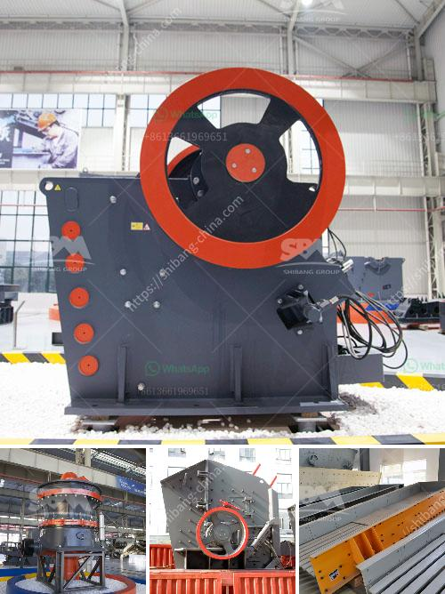

<h3>gypsum grinding machine manufacturer in india</h3>
India is the world's second largest producer of gypsum, clinker, and cement. India has a growing cement industry, with production capacity reaching 430 million tonnes in 2019. With the increasing demand for gypsum and cement, the gypsum grinding machine manufacturer in India is experiencing rapid growth.

In recent years, the gypsum grinding machine industry in India has been continuously advancing, which is increasingly becoming fierce competition. To survive in the competition, many manufacturers are actively introducing advanced technology and equipment, enhancing product quality and innovation, and improving production efficiency. This has greatly promoted the development of the gypsum grinding machine industry in India.

Gypsum grinding machine manufacturers in India have been greatly improved in terms of quality, innovation, and production scale. The main equipment in gypsum grinding production line is the gypsum grinding mill. It is made of high-quality materials and has stable performance, durable, and long service life. In addition, the equipment adopts the automatic control system, which can realize remote operation and improve production efficiency.

Another essential equipment in the gypsum grinding line is the jaw crusher. The gypsum jaw crusher breaks the large gypsum ore into small particles less than 30mm and transports it to the gypsum grinding mill for grinding. The gypsum grinding mill grinds the gypsum into a fine powder, which can be used as a finished product in the construction industry. To further improve the production efficiency and reduce energy consumption, the gypsum grinding mill is equipped with a high-efficiency separator, which can separate the fine powder from the coarse powder and recirculate the coarse powder back to the grinding chamber.

The gypsum grinding machine manufacturer in India can provide equipment with reliable performance and high quality. Shanghai Clirik Machinery Co., Ltd is a professional manufacturer of gypsum grinding machines. The gypsum grinding machines provided by the company have high efficiency, reliable performance, and stable operation. Their production capacity is strong, and the fineness of the finished product can be adjusted according to different needs.

In addition to gypsum grinding machines, Clirik Machinery also produces other mining equipment, such as stone mills, Raymond mills, micro powder grinding mills, etc. These mining equipment have their own unique advantages and can meet different processing needs. The company has a strong R&D team, can provide customized solutions, and provide customers with one-stop pre-sales, sales, and after-sales service.

In conclusion, the gypsum grinding machine manufacturer in India is in a period of rapid development. In addition to the gypsum grinding machine, the company also produces other mining equipment, which has a wide range of applications and excellent performance. With the continuous advancement of technology and the continuous improvement of product quality, the gypsum grinding machine manufacturer in India will have a broader market prospect.
<h3>Contact us</h3><ul><li><strong>Whatsapp:&nbsp;<a href="https://wa.me/8613661969651">+8613661969651</a></strong></li><li><a href="https://swt.shibang-china.com/?git&amp;zhl&amp;gypsum grinding machine manufacturer in india"><strong>Online Service(chat now)</strong></a></li></ul><h3>Related</h3><ul><li><a href='hammer mill prices south africa.md'>hammer mill prices south africa</a></li><li><a href='cost of set up mini cement plant in india.md'>cost of set up mini cement plant in india</a></li><li><a href='ball mill spares manufacturers in india.md'>ball mill spares manufacturers in india</a></li><li><a href='second hand crushing and screening plant sale.md'>second hand crushing and screening plant sale</a></li><li><a href='concrete crushing machine in india.md'>concrete crushing machine in india</a></li></ul>