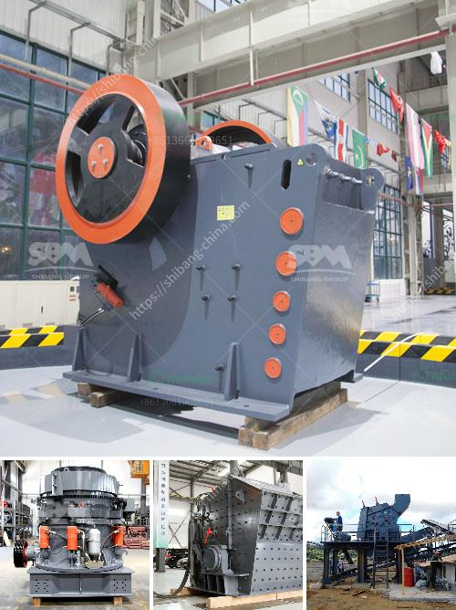

<h3>gypsum gypsum plant supplier from germany</h3>
Gypsum is an essential mineral that is widely used in various industries around the world. It is primarily used in the construction sector as a key ingredient in making gypsum boards, plasterboards, and other building materials. To meet the increasing demand for gypsum products, various gypsum plant suppliers are operating globally, with Germany being one of the leading players in this market.

Germany is renowned for its advanced technology and quality products, and the gypsum industry is no exception. German gypsum plant suppliers are known for their expertise in producing high-quality gypsum products that meet international standards. These suppliers employ cutting-edge production techniques and utilize state-of-the-art machinery to ensure the consistent and efficient manufacturing of gypsum products.

One prominent gypsum plant supplier from Germany is XYZ Gypsum Industries. With years of experience in the industry, XYZ Gypsum Industries has established itself as a reliable and trusted name in the field of gypsum production. The company is committed to delivering top-notch gypsum products that not only meet customer expectations but also comply with strict quality control measures.

XYZ Gypsum Industries operates its manufacturing plant in the heart of Germany, where it sources the finest quality gypsum rocks. These rocks are then processed using advanced equipment to extract pure gypsum powder, which serves as the base material for various applications. The company places great emphasis on maintaining the purity and consistency of its gypsum products, ensuring that they are suitable for a wide range of uses.

In addition to its focus on product quality, XYZ Gypsum Industries also prioritizes environmental sustainability. The company implements eco-friendly practices throughout its manufacturing process, minimizing waste generation and reducing environmental impact. XYZ Gypsum Industries adheres to all relevant environmental regulations and constantly invests in research and development to explore innovative methods for sustainable gypsum production.

What sets XYZ Gypsum Industries apart from its competitors is its unwavering commitment to customer satisfaction. The company has a dedicated customer support team that assists clients in choosing the right gypsum products for their specific requirements. XYZ Gypsum Industries also provides after-sales service, ensuring that customers receive prompt assistance in case of any issues or concerns.

Furthermore, XYZ Gypsum Industries has a reliable distribution network that allows it to supply its gypsum products to customers worldwide. Whether it is large-scale construction projects or individual consumers looking for high-quality gypsum materials, XYZ Gypsum Industries caters to a diverse range of clients. The company's efficient logistics and prompt delivery ensure that customers receive their orders on time, enabling smooth operations and project execution.

In conclusion, German gypsum plant suppliers, like XYZ Gypsum Industries, are leading the way in producing high-quality gypsum products. Their dedication to excellence, sustainable production practices, and commitment to customer satisfaction make them preferred suppliers in the global gypsum industry. As the demand for gypsum continues to rise, German gypsum plant suppliers are poised to play a vital role in meeting the needs of various industries worldwide.
<h3>Contact us</h3><ul><li><strong>Whatsapp:&nbsp;<a href="https://wa.me/8613661969651">+8613661969651</a></strong></li><li><a href="https://swt.shibang-china.com/?git&amp;zhl&amp;gypsum gypsum plant supplier from germany"><strong>Online Service(chat now)</strong></a></li></ul><h3>Related</h3><ul><li><a href='belt conveyor manufacturers in indonesia.md'>belt conveyor manufacturers in indonesia</a></li><li><a href='crush granite machine.md'>crush granite machine</a></li><li><a href='gypsum board making machinery.md'>gypsum board making machinery</a></li><li><a href='aggregate crushing plant layout.md'>aggregate crushing plant layout</a></li><li><a href='price list sag mill for sale.md'>price list sag mill for sale</a></li></ul>