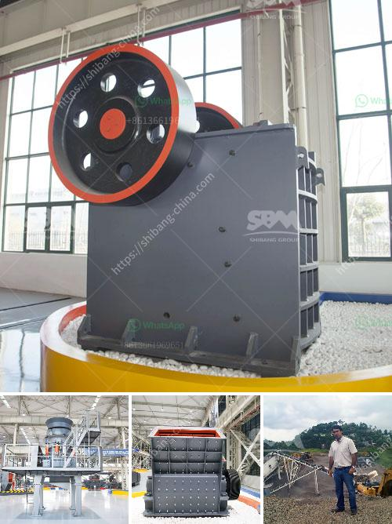

<h3>gypsum manufacturing unit in nigeria</h3>
Gypsum is a mineral commonly used in the construction industry for different purposes such as making plaster of Paris, drywall, and cement production. In Nigeria, the demand for gypsum is on the rise because of its abundant availability and the growth of the construction industry. Hence, setting up a gypsum manufacturing unit in Nigeria could potentially be a profitable investment.

Firstly, Nigeria has a vast reserve of gypsum, making it an ideal location for establishing a gypsum manufacturing unit. The mineral is found in various parts of the country, including Adamawa, Anambra, Bauchi, Benue, Borno, Delta, Edo, Gombe, Imo, Kogi, and Sokoto states. This widespread availability ensures a consistent supply of raw materials, reducing the cost of production and transportation.

Additionally, the Nigerian construction industry continues to experience significant growth, further driving the demand for gypsum-based products. The government's focus on infrastructure development, affordable housing schemes, and urbanization projects has created a favorable market for construction materials. As a result, the demand for gypsum-based products such as plasterboards, ceiling tiles, and cement additives is increasing continuously.

Furthermore, gypsum manufacturing operations can have a positive impact on the local economy. The establishment of a gypsum manufacturing unit can create employment opportunities, both directly and indirectly. Skilled and unskilled laborers can be employed in various stages of the production process, contributing to reducing unemployment rates. Additionally, the supply chain for gypsum manufacturing includes transportation, logistics, packaging, and distribution, which creates additional job opportunities.

Moreover, investing in a gypsum manufacturing unit can promote import substitution. Nigeria currently imports a significant amount of gypsum-based products to meet domestic demand. By setting up a manufacturing unit within the country, the dependence on imports can be reduced, leading to foreign exchange savings. This, in turn, strengthens the local currency and contributes to the overall economic growth.

Furthermore, the presence of a gypsum manufacturing unit locally can improve the quality and affordability of gypsum-based products for consumers. Imported gypsum products often face price fluctuations due to factors such as exchange rates, transportation costs, and international market dynamics. By producing gypsum products within the country, manufacturers can have better control over prices and ensure a consistent supply of quality products.

In conclusion, establishing a gypsum manufacturing unit in Nigeria has several advantages. The abundant availability of gypsum reserves, coupled with the growing construction industry, offers a lucrative market for gypsum-based products. The investment can stimulate the local economy through job creation, import substitution, and improved access to affordable and high-quality construction materials. Therefore, investors interested in the manufacturing sector should consider the gypsum industry in Nigeria as a promising opportunity.
<h3>Contact us</h3><ul><li><strong>Whatsapp:&nbsp;<a href="https://wa.me/8613661969651">+8613661969651</a></strong></li><li><a href="https://swt.shibang-china.com/?git&amp;zhl&amp;gypsum manufacturing unit in nigeria"><strong>Online Service(chat now)</strong></a></li></ul><h3>Related</h3><ul><li><a href='mobile gold processing 20 tph.md'>mobile gold processing 20 tph</a></li><li><a href='200 tph stone crusher price.md'>200 tph stone crusher price</a></li><li><a href='small gold rock crushers with chain.md'>small gold rock crushers with chain</a></li><li><a href='cone crusher equipment.md'>cone crusher equipment</a></li><li><a href='list of equipment used gold diamond mining.md'>list of equipment used gold diamond mining</a></li></ul>