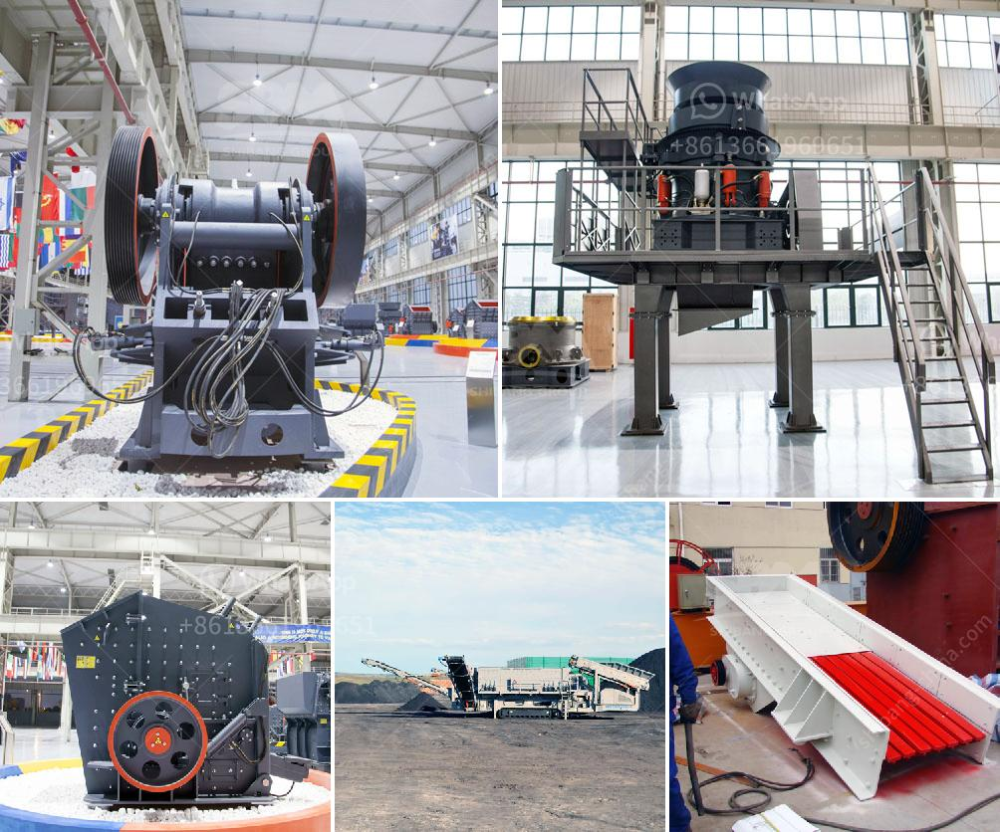

<h3>gypsum powder industry basic machines</h3>
The gypsum powder industry relies on various machines to process minerals such as gypsum. One crucial machine used in this industry is a gypsum grinder or crusher. The gypsum is crushed into small particles by a grinding mill, and then conveyed to a separator to separate the particles based on size. The separated gypsum powder is then bagged for distribution.

Another essential machine used in the gypsum powder industry is a calcination kiln. This kiln rapidly heats up the gypsum powder to remove any remaining moisture and convert it into a dry and stable form. The calcined gypsum, also known as stucco, is then cooled and stored for further processing.

To enhance the properties of gypsum powder, additives such as foaming agents or dispersants may be added during the grinding process. These additives help improve the flowability, setting time, or strength of the gypsum powder.

In addition to the basic machines mentioned above, the gypsum powder industry may utilize other equipment to facilitate production and ensure quality. For example, a dust collector is commonly used to capture and remove any airborne particles or dust generated during the grinding or calcination process. This helps maintain a clean and safe working environment.

Overall, the gypsum powder industry relies on a range of machines to process raw materials and produce high-quality gypsum powder products. These machines include grinders, calcination kilns, and various auxiliary equipment to enhance the properties and ensure the purity of the final product. As the demand for gypsum powder continues to grow, technological advancements and innovations in these machines contribute to the efficiency and sustainability of the industry.
<h3>Contact us</h3><ul><li><strong>Whatsapp:&nbsp;<a href="https://wa.me/8613661969651">+8613661969651</a></strong></li><li><a href="https://swt.shibang-china.com/?git&amp;zhl&amp;gypsum powder industry basic machines"><strong>Online Service(chat now)</strong></a></li></ul><h3>Related</h3><ul><li><a href='providers conveyor belts in mexico.md'>providers conveyor belts in mexico</a></li><li><a href='hammer crusher kapasitas 10 ton per jam dan ukurannya.md'>hammer crusher kapasitas 10 ton per jam dan ukurannya</a></li><li><a href='ball mill for sale uk.md'>ball mill for sale uk</a></li><li><a href='second hand crusher machine price.md'>second hand crusher machine price</a></li><li><a href='marbel grinder price in pakistan.md'>marbel grinder price in pakistan</a></li></ul>