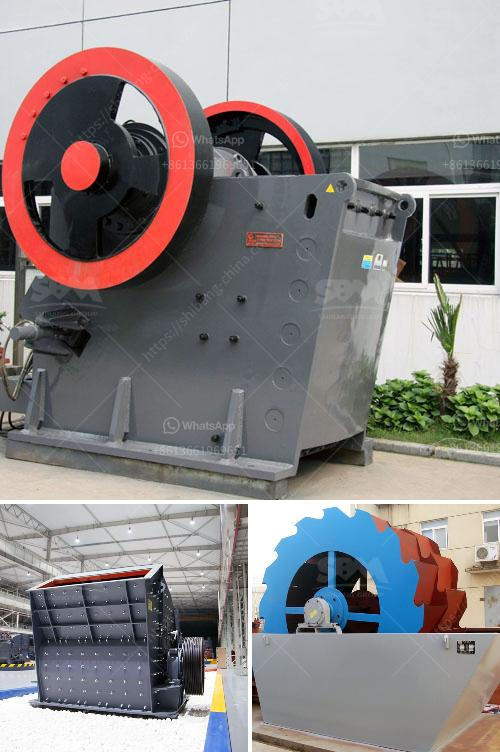

<h3>gypsum powder manufacturing plant price</h3>
Gypsum powder has been widely used in various industries for many years. As an important industrial raw material, it not only enhances the durability of buildings, but also plays a vital role in the setting time of cement. With the increasing demand for gypsum powder, many entrepreneurs are considering establishing a gypsum powder manufacturing plant. However, the price of such a plant is one of the major concerns for potential investors.

The price of a gypsum powder manufacturing plant depends on several factors, including the production capacity, location, and the amount of investment required. In general, a small-scale gypsum powder plant can be purchased at a price of around $200,000-$500,000. However, for a large-scale plant with an annual output of several million tons, the cost could be in the range of $5 million or more.

The production capacity is an important factor that affects the price of a gypsum powder manufacturing plant. Different plants have different production capacities, ranging from a few tons per day to several hundred tons per day. The larger the production capacity, the higher the price of the plant. This is because a larger plant requires more machinery and equipment, as well as a larger production site, which all contribute to the overall cost.

The location of the plant also affects the price. Gypsum powder manufacturing plants located in areas with low labor and land costs tend to have lower prices. On the other hand, plants located in developed countries or regions with high labor and land costs will have higher prices. Additionally, the availability of raw materials in the region can also impact the price. If gypsum is readily available in the area, it can reduce transportation costs and lower the overall price of the plant.

The amount of investment required is another important factor to consider. Building a gypsum powder manufacturing plant requires a significant investment in machinery, equipment, and infrastructure. These costs can vary depending on the scale of the plant and the technology used. More advanced technology may require a higher initial investment but can result in higher production efficiency and lower operating costs in the long run.

In conclusion, the price of a gypsum powder manufacturing plant can vary depending on several factors. The production capacity, location, and the amount of investment required all play a role in determining the price. It is important for potential investors to carefully evaluate these factors and consider their budget and long-term goals before making a decision. Consulting with industry experts, conducting market research, and comparing prices from different suppliers can also help in finding the most cost-effective solution.
<h3>Contact us</h3><ul><li><strong>Whatsapp:&nbsp;<a href="https://wa.me/8613661969651">+8613661969651</a></strong></li><li><a href="https://swt.shibang-china.com/?git&amp;zhl&amp;gypsum powder manufacturing plant price"><strong>Online Service(chat now)</strong></a></li></ul><h3>Related</h3><ul><li><a href='types of grinding mills.md'>types of grinding mills</a></li><li><a href='chinese tracked stone crushers.md'>chinese tracked stone crushers</a></li><li><a href='provider of conveyor belts for mining.md'>provider of conveyor belts for mining</a></li><li><a href='quartz production line.md'>quartz production line</a></li><li><a href='strainer of crushing machine.md'>strainer of crushing machine</a></li></ul>