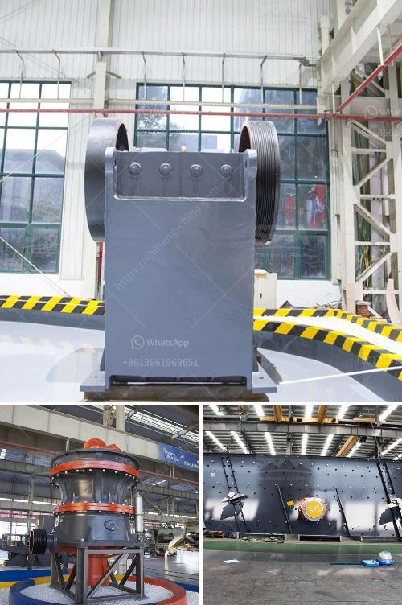

<h3>gypsum powder production process in india pdf</h3>
Gypsum powder production process in India is becoming more and more popular as the demand for this construction material is increasing. India is among the leading producers of gypsum in the world. The gypsum powder production process starts with the mining of gypsum and then size reduction of the rock through crushing, grinding, and screening, before being heated in a calcination process using a rotary kiln.

The calcined gypsum is then finely ground to produce the final powder called gypsum powder or plaster of Paris. The production of gypsum powder typically involves drying the raw gypsum and then crushing it into a fine powder. The powder is then heated to remove any remaining moisture and achieve the desired consistency and strength.

India has vast reserves of gypsum, making it an ideal location for gypsum powder production. The mining of gypsum is done on a large scale, and the quality of the mineral is carefully evaluated to ensure that it meets the required standards. The gypsum powder produced in India is used for various applications, including construction, agriculture, and industrial uses.

The use of gypsum powder in construction is particularly important as it provides excellent fire resistance, sound insulation, and thermal properties. The powder is mixed with water to form a paste that can be applied to walls and ceilings for a smooth and even finish. It is also used as a key ingredient in the production of cement, as it helps in controlling the setting time and improving the strength of the final product.

In conclusion, gypsum powder production in India is an essential process that involves mining, grinding, and calcination of gypsum to produce a fine powder. The powder is then used in various applications, including construction and industrial uses. India's abundant gypsum reserves make it a reliable source for gypsum powder production.
<h3>Contact us</h3><ul><li><strong>Whatsapp:&nbsp;<a href="https://wa.me/8613661969651">+8613661969651</a></strong></li><li><a href="https://swt.shibang-china.com/?git&amp;zhl&amp;gypsum powder production process in india pdf"><strong>Online Service(chat now)</strong></a></li></ul><h3>Related</h3><ul><li><a href='capital requirement for one ton cement mill.md'>capital requirement for one ton cement mill</a></li><li><a href='costs for a stone crusher plant.md'>costs for a stone crusher plant</a></li><li><a href='used crusher for sale in jamaica.md'>used crusher for sale in jamaica</a></li><li><a href='processing of bauxite ore.md'>processing of bauxite ore</a></li><li><a href='gypsum powder industry basic machines.md'>gypsum powder industry basic machines</a></li></ul>