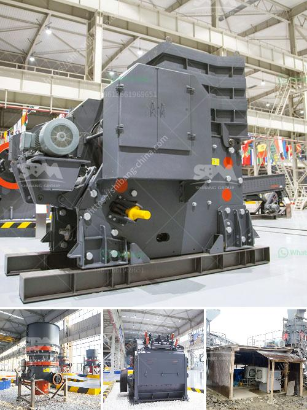

<h3>gypsum processing equipment</h3>
Gypsum is a mineral that has been used in various industries for centuries. Its main component is calcium sulfate dihydrate (CaSO4·2H2O), which is formed as a result of the evaporation of seawater. Today, gypsum is widely utilized in construction, agriculture, and industrial applications, making its processing equipment essential for efficient production.

There are several types of gypsum processing equipment available, each with its own specific functions. One of the most common pieces of equipment is the crusher, which is responsible for crushing large-sized gypsum ore into smaller pieces suitable for further processing. Crushers can operate in a continuous or batch mode, depending on the specific requirements of the operation. They come in various sizes and configurations, with some capable of handling extremely high capacities.

After crushing, the gypsum ore is typically further processed using a grinding mill. Grinding mills are used to grind the material into a fine powder, which is then used in various applications. There are several types of grinding mills available, including ball mills, hammer mills, and vertical roller mills. Each type of mill has its own advantages and disadvantages, depending on the specific requirements of the application.

Once the gypsum has been ground to the desired fineness, it is often necessary to dry the material before it can be further processed. Drying equipment, such as rotary dryers or flash dryers, is commonly used to remove excess moisture from the gypsum. This is essential to ensure that the final product has the desired properties and can be easily handled and transported.

In addition to crushers, grinding mills, and drying equipment, there are several other types of equipment used in the gypsum processing industry. These include screens, conveyors, and dust collectors. Screens are used to separate the crushed gypsum into different sizes, while conveyors are used to transport the material between different processing stages. Dust collectors are essential to maintain a clean and safe working environment by capturing and containing any dust generated during the processing operation.

Overall, the gypsum processing equipment plays a crucial role in the efficient production of gypsum products. It not only ensures that the material is processed to the desired specifications but also contributes to the overall productivity and profitability of the operation. With the advancements in technology, modern processing equipment is designed to be energy-efficient and environmentally friendly, reducing the impact on the surrounding environment.

In conclusion, gypsum processing equipment is indispensable in various industries that rely on gypsum products. From construction to agriculture and industrial applications, the efficient and effective processing of gypsum requires specialized equipment such as crushers, grinding mills, drying equipment, screens, conveyors, and dust collectors. Investing in high-quality equipment and staying up-to-date with the latest technological advancements can greatly enhance the productivity and profitability of gypsum processing operations.
<h3>Contact us</h3><ul><li><strong>Whatsapp:&nbsp;<a href="https://wa.me/8613661969651">+8613661969651</a></strong></li><li><a href="https://swt.shibang-china.com/?git&amp;zhl&amp;gypsum processing equipment"><strong>Online Service(chat now)</strong></a></li></ul><h3>Related</h3><ul><li><a href='stone crusher for gold.md'>stone crusher for gold</a></li><li><a href='recycling of construction materials.md'>recycling of construction materials</a></li><li><a href='mica processing machinery pictures.md'>mica processing machinery pictures</a></li><li><a href='japan jaw crusher machine.md'>japan jaw crusher machine</a></li><li><a href='cone crushers manufacturer.md'>cone crushers manufacturer</a></li></ul>