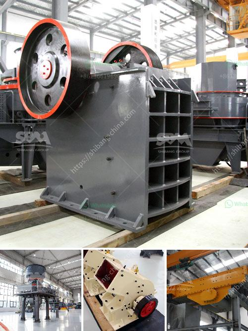

<h3>gypsum processing machine price list</h3>
Gypsum is a mineral that is commonly used in the construction industry. It is a soft, white sedimentary rock that is formed from the evaporation of seawater. Gypsum has many unique properties, such as its ability to harden or set into a solid form when mixed with water, making it an essential component in building materials like drywall.

To process gypsum into a usable form, it needs to be crushed into smaller particles and heated to remove any remaining moisture. This is where gypsum processing machines come into play. These machines are designed to efficiently and effectively process gypsum, reducing it into a fine powder or pellet form that can be used in various applications.

The price of gypsum processing machines can vary depending on the specific model and capacity. Generally, smaller machines are more affordable, with prices starting around $10,000. Larger, more advanced machines can cost upwards of $100,000.

There are many factors to consider when determining the appropriate machine for your gypsum processing needs. These include the desired output capacity, the quality of the final product, and any specific requirements or customization needs. It is always recommended to consult with an industry expert or supplier to ensure you choose the right machine for your specific application.

In addition to the machine itself, there may be additional costs to consider, such as installation, maintenance, and any necessary spare parts or accessories.

Overall, investing in a gypsum processing machine can be a worthwhile investment for companies in the construction industry. It allows for efficient and cost-effective processing of gypsum, ensuring a steady supply of high-quality materials for various applications. By carefully considering the price list and consulting with experts, companies can find the right machine to meet their specific needs and budget.
<h3>Contact us</h3><ul><li><strong>Whatsapp:&nbsp;<a href="https://wa.me/8613661969651">+8613661969651</a></strong></li><li><a href="https://swt.shibang-china.com/?git&amp;zhl&amp;gypsum processing machine price list"><strong>Online Service(chat now)</strong></a></li></ul><h3>Related</h3><ul><li><a href='ballast crusher prices in kenya.md'>ballast crusher prices in kenya</a></li><li><a href='iron ore beneficiation flowsheet.md'>iron ore beneficiation flowsheet</a></li><li><a href='cement plant layout pdf.md'>cement plant layout pdf</a></li><li><a href='gypsum processing plant in.md'>gypsum processing plant in</a></li><li><a href='mineral used for making talcum powder.md'>mineral used for making talcum powder</a></li></ul>