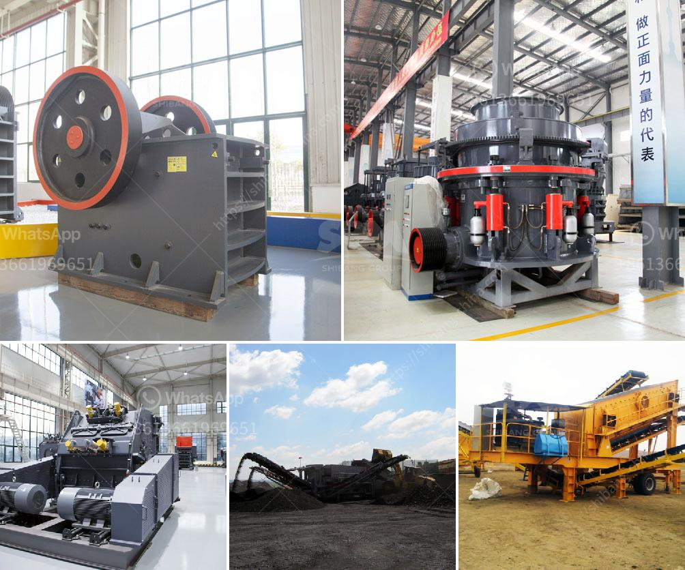

<h3>gypsum processing plant for sale</h3>
Gypsum is a widely used mineral in many industries. Its main component is calcium sulfate, which provides vital nutrients to plants and improves soil quality. Gypsum is also used in the construction industry for making plaster and drywall.

The demand for gypsum has been steadily increasing, leading to the establishment of gypsum processing plants around the world. These plants extract gypsum rock from mines or quarries and then process it into various forms, such as granules or powder, depending on its intended use.

If you are in the market for a gypsum processing plant, there are several factors to consider. First and foremost, you should ensure that the plant is equipped with the necessary machinery and equipment for efficient processing. This may include crushers, screens, conveyors, and drying equipment.

Another crucial aspect is the capacity of the plant. A plant with a higher capacity can process larger volumes of gypsum, allowing for increased production and potential growth in the future. On the other hand, smaller plants may be more suitable for specific applications or limited budgets.

Cost is also a significant consideration. You should compare prices from different suppliers to ensure that you are getting a competitive deal. Additionally, it is advisable to choose a supplier that offers after-sales services, such as installation, training, and technical support, to ensure smooth operations.

Furthermore, it is essential to assess the reputation and track record of the supplier. Look for a company with experience in gypsum processing and a solid customer base. Reading customer reviews and testimonials can provide valuable insights into the quality of their products and services.

In conclusion, the demand for gypsum is growing, making it a promising investment opportunity. When searching for a gypsum processing plant for sale, consider factors such as machinery and equipment, capacity, cost, and supplier reputation. With careful evaluation, you can find a plant that meets your needs and contributes to your success in the gypsum industry.
<h3>Contact us</h3><ul><li><strong>Whatsapp:&nbsp;<a href="https://wa.me/8613661969651">+8613661969651</a></strong></li><li><a href="https://swt.shibang-china.com/?git&amp;zhl&amp;gypsum processing plant for sale"><strong>Online Service(chat now)</strong></a></li></ul><h3>Related</h3><ul><li><a href='ultrafine mill crusher price in india.md'>ultrafine mill crusher price in india</a></li><li><a href='coal crusher size 100 tph.md'>coal crusher size 100 tph</a></li><li><a href='used portable gravel screens for sale.md'>used portable gravel screens for sale</a></li><li><a href='alluvial gold washing plant in zimbabwe.md'>alluvial gold washing plant in zimbabwe</a></li><li><a href='grinding media charge calculation in cement ball mills.md'>grinding media charge calculation in cement ball mills</a></li></ul>